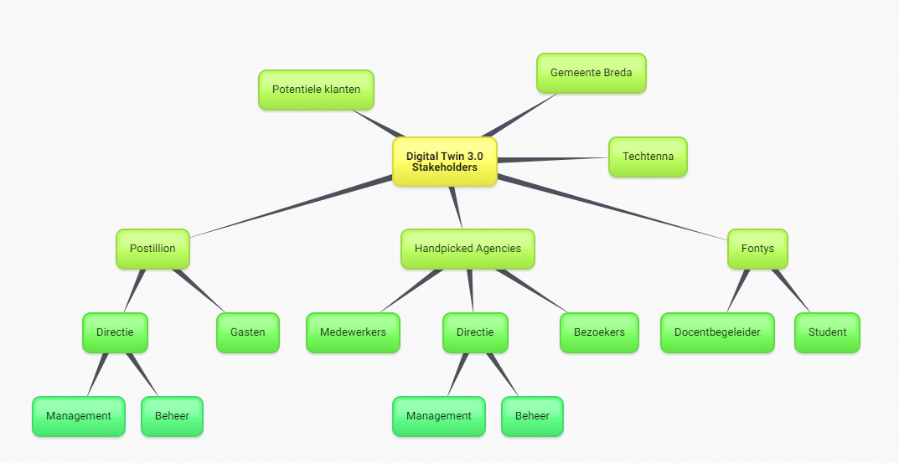
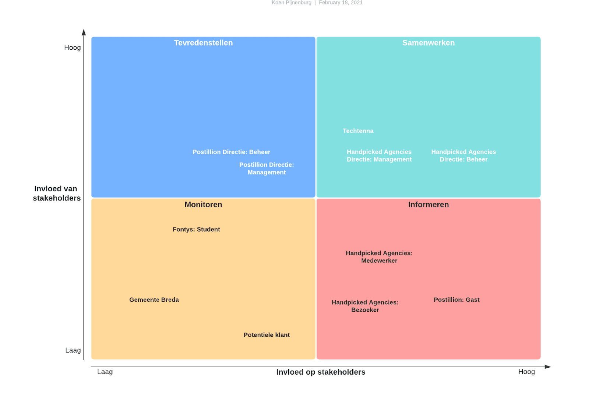
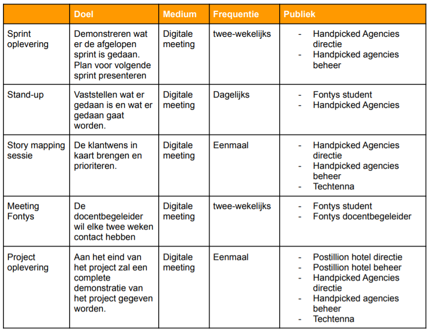
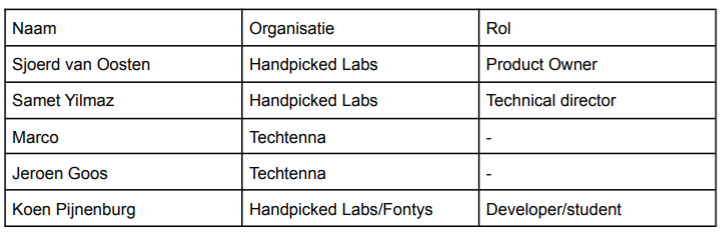
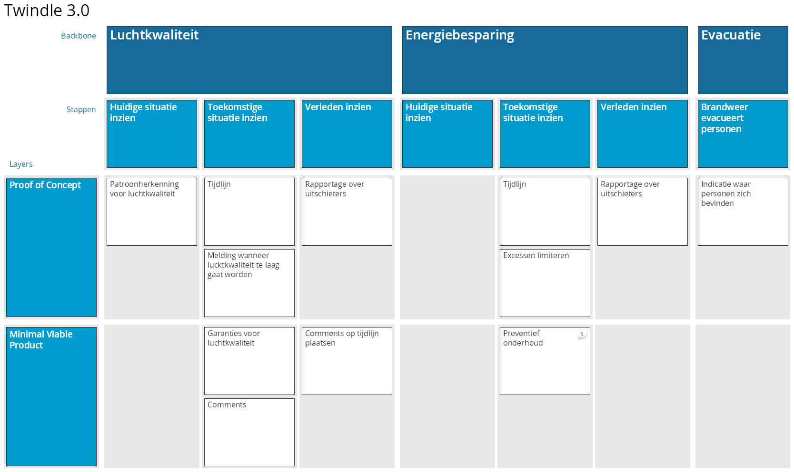
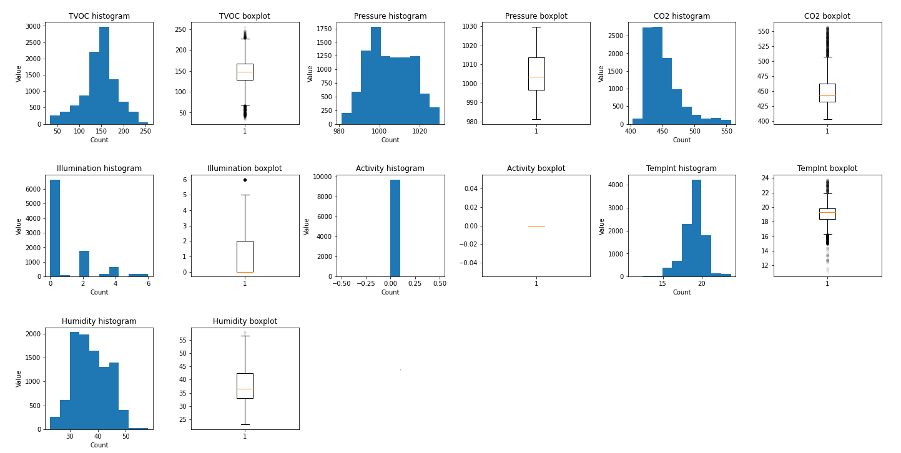
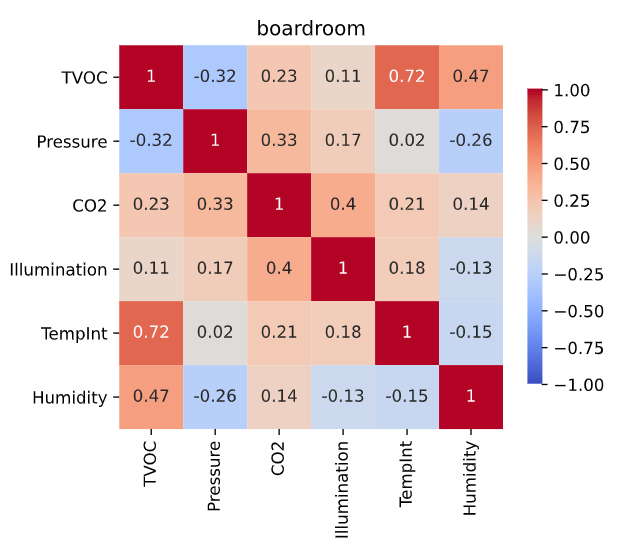
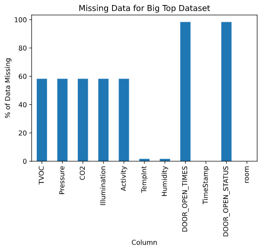

## Stakeholders analyse

Om te bepalen welke partijen relevant zijn voor het project is een stakeholders analyse uitgevoerd [^1]. De methodiek om de stakeholders analyse uit te voeren bestaat uit het identificeren- , prioriteren- en het begrijpen van deze groepen personen[^2].

### Identificeren

Om de stakeholders te kunnen identificeren is een brainstormsessie gehouden. Het resultaat van deze sessie is een mindmap van alle personen of entiteiten die invloed hebben op het project. In de onderstaande afbeelding is deze mindmap te zien.



<center><small>Afbeelding 1: Stakeholders mindmap</small></center>

### Prioriteren

De stakeholders die in het vorige hoofdstuk geïdentificeerd zijn zullen in dit hoofdstuk worden geprioriteerd. Dit wordt gedaan door te kijken wat hun niveau van invloed is en hoeveel belang zij hebben bij het project. In het onderstaande “Stakeholder Power Interest Grid” wordt dit gevisualiseerd.



<center><small>Afbeelding 2: Power interest grid</small></center>

### Begrijpen

De volgende stap is om, per stakeholder, te begrijpen wat hun relatie is tot het project. Dit is gedaan door per stakeholder categorie een
aantal vragen te stellen en te beantwoorden [^3]. Gebaseerd op deze vragen is het onderstaande communicatieplan opgesteld.



<center><small>Afbeelding 3: Communicatie plan</small></center>

## Story mapping

Tijdens het project zal een agile werkwijze worden gehanteerd. Een van de onderdelen hiervan is een product backlog waarin alle taken zijn vastgelegd. De techniek die gebruikt is voor het opstellen van deze backlog is story mapping[^4]. In dit hoofdstuk wordt de voorbereiding en conclusie van deze story mapping sessie[^5] toegelicht.

### Voorbereiding

Aan de hand van het communicatie plan, zie _afbeelding 3: Communicatie plan_ is een lijst met personen opgesteld die aanwezig moeten zijn bij de story mapping sessie.



<center><small>Afbeelding 4: Aanwezigen</small></center>

Personas zijn gebruikt worden om een duidelijker beeld bij de gebruikers van de applicatie te krijgen. Uiteindelijk is vastgesteld dat er twee gebruikersgroepen binnen de applicatie zijn [^6]. Hotelmanagers & consumers.

### Resultaat

De story mapping sessie heeft plaatsgevonden op 02-03-2021. Om iedereen duidelijk te maken wat er verwacht werd was een korte presentatie gegeven. Daarna is de onderstaande story map opgesteld. Deze is gebruikt om via Trello een backlog op te stellen.


<center><small>Afbeelding 5: Story map</small></center>

## Exploratory Data Analyse

De eerste stap om te kunnen bepalen welke machine learning modellen toegepast kunnen worden is het analyseren van de data die Twindle tot nu toe verzameld heeft. Hiervoor is een Exploratory Data Analyse[^7] (EDA) gemaakt volgens de methode van Sunil Ray[^8]. Dit bestaat uit de volgende onderdelen:

1. Variable identificatie
2. Univariate analyse
3. Multivariate analyse
4. Missende gegevens
5. uitschieters

### Variable identificatie

De volgende gegevens, en hun datatype, zijn aanwezig in de dataset. Een overzicht van de handelingen die gedaan zijn om de onjuiste datatypes op te lossen kan gevonden worden in hoofdstuk 1.1[^9].

```
TVOC                       float64 # 'Total volatile organic componds' in PPB
Pressure                   float64 # Luchtdruk in Pa.
CO2                        float64 # CO2 concentratie in PPM.
Illumination               float64 # Verlichtingsniveau in flux.
Activity                   float64 # 'Person in Room' (PIR)
TimeStamp           datetime64[ns] # Datum en tijd van meting
TempInt                    float64 # Temperatuur in graden celsius
Humidity                   float64 # Luchtvochtigheidspercentage
DOOR_OPEN_STATUS           float64 # Boolean of de deur open of dicht is.
DOOR_OPEN_TIMES            float64 # Aantal keer dat de deur geopend is.
room                        object # Ruimte waarin de meting is vericht.
```

### Univariate analyse

Univariate analyse is de eenvoudigste vorm van data analyse. Tijdens deze analyse wordt elke variabele afzonderlijk geanalyseerd. Dit wordt gedaan door de gegevens in histogrammen en boxplots te visualiseren. Hierdoor kunnen eventuele afwijkingen of uitschieters gedetecteerd worden.



<center><small>Afbeelding 6: Big Top's Boardroom distributie</small></center>

In de bovenstaande afbeelding zijn de distributies van alle meetwaarden in de boardroom van de Big Top gevisualiseerd. Hierin valt te zien dat de meeste waarden een redelijk normale distributie hebben. Sommigen zoals bijvoorbeeld de CO2 waarden hebben afwijkingen en uitschieters. Tijdens de modellering fase zal hier rekening mee gehouden moeten worden.

### Multivariate analyse

Tijdens dit soort data analyse zullen de verbanden tussen twee variabelen worden geanalyseerd. Dit zal worden gedaan door correlatiecoëfficiënt-heatmaps te maken. In _afbeelding 7: Big Top's boardroom correlaties_ is een voorbeeld van deze correlatiecoëfficiënt-heatmaps te zien.



<center><small>Afbeelding 7: Big Top's Boardroom correlaties</small></center>

Hieruit kunnen we opmaken dat er meerdere waarden zijn die redelijk sterk met elkaar gecorreleerd zijn. Bijvoorbeeld TVOC & temperatuur, dit zou een indicatie kunnen zijn dat wanneer de temperatuur stijgt de TVOC waarde meestijgt. Om dit te kunnen uitsluiten zal per meetwaarden verder onderzoek verricht moeten worden.

### Missende gegevens

In de onderstaande afbeelding is het percentage van de data wat mist gevisualiseerd. Het is opvallend dat de missende data in clusters opgedeeld kan worden, namelijk:

- TVOC, Pressure, CO2, Illumunation, Activity
- TempInt, Humidity
- DOOR_OPEN_TIMES, DOOR_OPEN_STATUS



<center><small>Afbeelding 8: Big Top's missende gegevens</small></center>

Na de applicatie beter te bekijken is bevonden dat er per ruimte andere gegevens worden bijgehouden. Hierdoor is de clustervorming van de missende gegevens te verklaren. Tijdens het modelleren moet hier rekening mee gehouden worden.

### Uitschieters

Tijdens de univariate analyse is gebleken dat sommige meetwaarden veel uitschieters bevatten. Om deze op te lossen is de onderstaande "interquartile range outlier removal" methode gebruikt

```
def iqr_outlier_removal(df, scale=1.5):
    """Removes outliers based on the interquartile range method."""
    # Calculate 1st and 3rd quantile and the range between them (iqr)
    q1 = df.quantile(0.25)
    q3 = df.quantile(0.75)
    iqr = q3 - q1

    # Calculate the upper- and lower boundries
    lower = q1 - scale * iqr
    upper = q3 + scale * iqr

    # Filter out non numeric data
    non_numeric = df.select_dtypes(exclude=np.number).columns.values
    df_in = df.select_dtypes(np.number)

    # Filter dataframe based on upper- and lower boundries
    df_out = df_in[~((df_in < lower) | (df_in > upper)).any(axis=1)]

    print(f'Removed {df_in.shape[0] - df_out.shape[0]} outliers.')

    # Rejoin non numeric data and return resulting dataframe
    return df_out.join(df[non_numeric])
```

Wanneer deze methode wordt gebruikt op de datasets verwijderd het ongeveer 20% van de data. Het kan zijn dat dit teveel is en dat er niet meer genoeg data over is om effectieve modellen van te maken. In dit geval kan de `scale` parameter worden aangepast zodat er minder data als uitschieter wordt gezien.

### Bevindingen

Deze Exploratory Data Analyse is uitgevoerd om te kijken hoe de data die door de Twindle applicatie verzameld wordt in elkaar zit. De volgende bevindingen zijn gemaakt:

- De gegevens bevatten grote uitschieters.
- Niet voor elke kamer worden dezelfde gegevens verzameld.
- De gegevens zijn erg scheef, wat onnauwkeurigheden kan veroorzaken bij gebruik in regressie-algoritmen.
- Er is een gebrek aan sterk gecorreleerde features.
- De methode voor het verwijderen van uitschieters verwijdert ongeveer ~ 20% van de gegevens; de `scale` parameter kan worden aangepast om dit te verlagen.

Op basis van deze bevindingen kunnen de data requirements worden onderzocht.

## Requirements

vanuit de voorgaande analyses zijn requirements opgesteld. Deze vallen in de volgende drie categorieen:

- Software
- Data
- Machine learning

### Software requirements

Gebaseerd op het [resultaat](#resultaat) van de story mapping sessie zijn de volgende requirements opgesteld voor het software product. Deze zijn geprioriteerd door middel van de MosCoW[^10] methode.

| ID  | Beschrijving                                                        | Prioritijd |
| --- | ------------------------------------------------------------------- | ---------- |
| 1.  | Tijdlijn waarop de toekomstige- en verleden meldingen te zien zijn. | Must       |
| 2.  | Meldingen wanneer luchtkwaliteit te laag dreigt te worden.          | Must       |
| 3.  | Comments plaatsen op de tijdlijn.                                   | Must       |
| 4.  | Uitschieters rapportage.                                            | Could      |
| 5.  | Energiebesparing voorspellen om exessen te voorkomen.               | Could      |
| 6.  | Preventief onderhoud voorspellen\*.                                 | Won't      |
| 7.  | Indicatie waar personen zich bevinden\*.                            | Won't      |

De kern van het systeem zal zijn dat er meldingen gemaakt kunnen worden wanneer de luchtkwaliteit in gevaar is. Hiervoor zal een tijdlijn aan de bestaande applicatie worden toegevoegd om deze meldingen inzichtbaar te maken.

<small>\*In het resultaat van de storymapping staat beschreven dat requirement #7 bij het proof of concept hoort. Later is besloten om de scope in te perken tot luchtkwaliteit voorspellingen. </small>

### Data requirements

Om te bepalen of aan de luchtkwaliteitseisen wordt voldaan is een overzicht samengesteld met minima en maxima opgesteld, zie _tabel 1: minima & maxima waarden_. Om deze waarden effectief te kunnen voorspellen zal extra data verzameld moeten worden, per meetwaarde is dit onderzocht[^11].

|       Meetwaarde | Min (waarschuwing) | Max (waarschuwing) | Min (gevaar) | Max (gevaar) |
| ---------------: | ------------------ | ------------------ | ------------ | ------------ |
|      Temperatuur | 17                 | 22,5               | 16,5         | 23,5         |
| Luchtvochtigheid | 40                 | 60                 | 30           | 70           |
|              CO2 | 400                | 800                | 300          | 1200         |
|             TVOC | -1                 | 200                | -1           | 250          |

<center><small>tabel 1: minima & maxima waarden</small></center>

Uit dit onderzoek is de volgende lijst met te verzamelen data gekomen:

**Gebouw**

- Oppervlakte van de ruimten
- Bouwjaar
- Verwarming/airconditioning instellingen
- Raamstand

**Weer**

- Buitentemperatuur
- Luchtvochtigheid
- Zonnestraling

### Machine learning requirements

Vanuit de product owner is het doel gesteld dat de modellen tenminste 90% accuraat moeten zijn. De meetwaarden die gemodelleerd dienen te worden zijn continu en niet uit te
drukken in procent accuracy. R-squared score kan gebruikt worden voor dit soort modellen. Het geeft een waarde tussen 0.0 en 1.0 aan wat geïnterpreteerd kan worden als een percentage. Wanneer een R2 Score van 0.90 wordt behaald zal het model aan de eisen voldoen.

Om de modellen onderling met elkaar te vergelijken zal, naast r-squared, ook de root mean squared error scoring methode worden gebruikt. Deze methode resulteert in een waarde in dezelfde eenheid als het target. Hierdoor kan gezien worden in hoeverre de gemiddelde voorspelling zal afwijkt van de realiteit.

[^1]: [Stakeholders analyse rapport](pdfs/stakeholders_analyse.pdf)
[^2]: [LucidChart: How to do a stakeholder analysis](https://www.lucidchart.com/blog/how-to-do-a-stakeholder-analysis)
[^3]: [Stakeholders analyse rapport hoofdstuk 3: Begrijpen](pdfs/stakeholders_analyse.pdf#page=7) _blz. 7 - 9_
[^4]: [AltexSoft: A Complete Guide to User Story Mapping](https://www.altexsoft.com/blog/uxdesign/a-complete-guide-to-user-story-mapping-process-tips-advantages-and-use-cases-in-product-management/)
[^5]: [Story mapping rapport](pdfs/story_mapping.pdf)
[^6]: [Story mapping rapport hoofdstuk 1.1; Personas](pdfs/story_mapping.pdf#page=5) _blz. 5 - 6_
[^7]: [Exploratory Data Analyse](htmls/eda.html)
[^8]: [Analytics Vidya: A Comprehensive Guide to Data Exploration](https://www.analyticsvidhya.com/blog/2016/01/guide-data-exploration/)
[^9]: [Exploratory Data Analyse: 1.1 Insights](htmls/eda.html#1.1-Insights)
[^10]: [MosCow methode](https://nl.wikipedia.org/wiki/MoSCoW-methode)
[^11]: [Data requirements rapport](pdfs/data_requirements.pdf)
