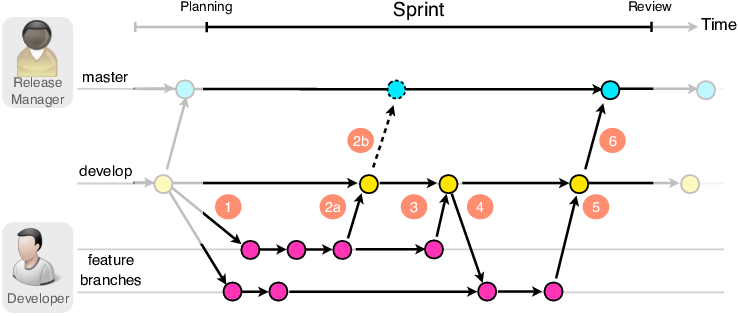
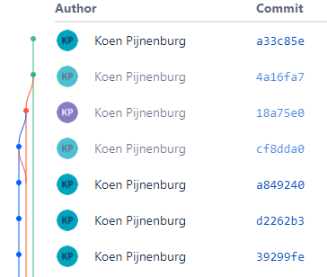

## Versiebeheer

Het versiebeheersysteem wat binnen Handpicked Labs wordt toegepast is [BitBucket](https://www.bitbucket.org). Om dit systeem zo soepel mogelijk te laten verlopen is de onderstaande branching strategie toegepast.



<center><small>Afbeelding 1: Branching strategie</center></small>

Deze strategie is succesvol toegepast, zie afbeelding 2. Door deze strategie toe te passen is er voor gezorgd dat merge conflicten tot een minimum bleven en het mogelijk was om continous integration en deployment toe te passen.

<center>

</center>
<center><small>Afbeelding 2: Branching strategie implementatie</center></small>

## Automatische tests
Tijdens het ontwikkelen van de machine learning API is zoveel mogelijk gewerkt op een test driven manier. Dit betekend dat methoden getests werden terwijl ze geïmplementeerd wrden. Op deze manier kon gevalideerd worden dat de code werkt na verwachtingen. Onderstaand valt het resultaat van deze tests te zien.

```
test_create_no_invalid_parameters_entity_persisted (tests.test_base_service.TestBaseService) ... ok
test_delete_entity_entity_exists_deleted (tests.test_base_service.TestBaseService) ... ok
test_get_all_none_exist_returns_empty_list (tests.test_base_service.TestBaseService) ... ok
test_get_all_one_record_returns_list_of_one (tests.test_base_service.TestBaseService) ... ok
test_get_by_filter_entity_does_not_exist_returns_empty_list (tests.test_base_service.TestBaseService) ... ok
test_get_by_filter_entity_exists_returns_entity (tests.test_base_service.TestBaseService) ... ok
test_get_by_id_entity_does_not_exist_returns_none (tests.test_base_service.TestBaseService) ... ok
test_get_by_id_entity_exists_returns_entity (tests.test_base_service.TestBaseService) ... ok
test_update_entity_not_found_raises_typeerror (tests.test_base_service.TestBaseService) ... ok
test_update_entity_prohibited_raises_typeerror (tests.test_base_service.TestBaseService) ... ok
test_get_between_dates_all_correct_four_forecasts_returned (tests.test_forecast_service.TestForecastService) ... ok
test_get_between_dates_none_found_returns_empty_list (tests.test_forecast_service.TestForecastService) ... ok
test_get_between_dates_not_datetime_raises_typerror (tests.test_forecast_service.TestForecastService) ... ok
test_filter_between_date_end_before_start_raise_error (tests.test_ingestion_service.TestDummyIngestionService) ... ok
test_remove_outliers_correct_dicts_outliers_were_removed (tests.test_preparation_methods.TestPreparationMethods) ... ok
test_remove_outliers_min_higher_than_max_raises_value_error (tests.test_preparation_methods.TestPreparationMethods) ... ok
test_resample_index_not_of_type_DatetimeIndex_raises_IndexError (tests.test_preparation_methods.TestPreparationMethods) ... ok
test_resample_interpolate_returns_resamples_dataframe (tests.test_preparation_methods.TestPreparationMethods) ... ok
test_resample_time_unit_is_not_H_or_T_raises_ValueError (tests.test_preparation_methods.TestPreparationMethods) ... ok
test_split_into_segments_datetimeindex_returns_tuple_of_lists (tests.test_preparation_methods.TestPreparationMethods) ... ok
test_split_into_segments_no_datetimeindex_raises_typeerror (tests.test_preparation_methods.TestPreparationMethods) ... ok
test_train_test_split_segments_correct_nr_of_rows_returnd (tests.test_preparation_methods.TestPreparationMethods) ... ok

----------------------------------------------------------------------
Ran 22 tests in 0.673s

OK
```

## Deployment
BitBucket biedt de mogelijkheid om via het BitBucket pipelines een automatische deployment straat in te richten. Momenteel is er bij Handpicked Labs geen omgeving waar deze pipelines de applicaties naar kunnen deployen. Om voorbereid te zijn op een toekomst wanneer dit wel mogelijk zou zijn is de onderstaande pipeline ontwikkeld.

```
image: python:3.8

pipelines:
  default:
    - parallel:
        - step:
            name: Test
            caches:
              - pip
            script:
              - if [ -f requirements.txt ]; then pip install -r requirements.txt; fi
              - python -m unittest
```


## Feedback

### Project plan

**Sjoerd - 10-02-2021** <br>
In de introductie van het project plan stond dat er een Digital Twin ontwikkeld was voor het kantoorpand van Handpicked Agencies. Sjoerd had de opmerking dat er tevens een implementatie gemaakt is voor in hotelomgevingen. De introductie is herschreven zodat deze niet specifiek vermeld waar Digital Twins actief zijn.

Daarnaast had Sjoerd nog feedback op de doelstelling. Ik had opgeschreven dat de Twindle applicatie uitgebreid kan worden zodat personen,bijvoorbeeld, de verwarming aan kunnen zetten zodra zij zien dat het te koud wordt. Volgens Sjoerd zou ik hier groter kunnen denken. Na aanleiding van deze feedback heb ik het doel vergroot naar grootschalige verbetering van de luchtkwaliteit waardoor de beleving van de personen in het gebouw vergroot wordt.

**Samet - 19-02-2021** <br>
Ik had beschreven dat we de applicatie wilde uitbreiden zodat deze informatie uit het verleden en toekomst kan tonen. Volgens Samet kon dit beter verwoord worden. Na aanleiding van deze feedback heb ik beter beschreven welke meetwaarden voorspeld gaan worden.

Daarnaast had ik Samet een vraag gesteld waarom er gekozen was om TVOC waarde bij te meten en te gebruiken als luchtkwaliteit indicator. Zijn reactie hierop was dat voor luchtkwaliteit er meer nodig is dan alleen TVOC. Een combinatie van Co2, TVOC, Luchtvochtigheid en temperatuur zegt iets over de luchtkwaliteit. Tijdens de rest van het project kan ik er rekening mee houden dat deze waarden gebruikt worden voor luchtkwaliteit.

**Bartosz - 01-03-2021** <br>
"Het is aan mij om te onderzoeken hoe Twindle het meest effectief ingezet kan worden voor deze implementatie" het lijkt mij heel breed, kan je ket beter scopen? het gaat over softwre toch en niet business modelleren etc. je gaat een bestaande applicatie aanpassen zodat het model van een hotel van gemaakt kan worden? Wat is de baat van jouw project voor de handipicked en voor de hotel zelf?

Het blijft nog steeds niet helder wat de kern van het probleem is dat je gaat oplosseen en wie erbij welke baat zal hebben (gecontrasteerd met de gebreken van de al bestaande oplossing). je deed een analyze in 1.2.1 op detail niveau, maar voeg die globale informatie wel toe in het begin van je document zoadt de lezer weet wat gaat dit project aanpakken.

- Introductie aangepast zodat hier een betere koppeling is tussen het probleem en de huidige implementatie.

  1.3 gelimiteerde kennis van web hoort in risicos en niet hier. ook zijn de software aspecten van je project mogelijk hier al te vatten. je gaat backend en frontend werk doen, testen, data cleaning etc. Wat zijn de doelen dat je vanuit EDA wilt halen (hoe en waarvoor hoop je de restulaten ervan in te zetten in je daaropvolgende project delen?)?

- Begrenzing vastgesteld
- SW aspecten toegevoegd aan scope en randvoorwaarden
- Gelimiteerd web kennis verplaats naar risico's

  1.4 als je naar die methodiek kijkt dan kan je hieruit ook een taal van deliverables nemen en expliciet noemen/verwerken in de rest van je document. bv. data requirements- ga je die opstellen of is dat niet in scope? deployments, hoe zie je dat voor zich?

  1.5 "zijn er ethische..." vermijd ja nee vragen. better "welke"
  voeg ook iets toe over evaluatie van je oplossing, dat weet je nu nog niet zeker hoe dat het beste kan gebeuren.Weet je ook genoeg van air quality om te kunnen bepalen hoe en wat te meten en wat is goed en wat niet?

  1.6 Tests niet vergeten, verder hoe worden je machine learning modellen getrained en geëvalueerd is ook iets dat je gaat beschrijven misschien ga je er zelf een pipeline voor bouwen. Hoe ga je verschillende experimenten rapporteren en bijhouden?

- Model evaluatie beschreven
- Integratie verduidelijkt

  3.2 Hoeveel interaties van het IBM process ga je uitvoeren? misschien helpt het bij het planing.
  probeer ook wat project specifieker te zijn in je planing (bv. welke onderzoeken ga je afronden in welke sprints?

- Producten en onderzoeken aan planning gekoppeld
- Verduidelijkt dat er twee iteraties van het IBM process uitgevoerd gaan worden.

  4.1 Hoe ga je de integratie testen? En de software stukken? Automatisch, met hand?

- Test uitleg toegevoegd

Over je vraag voor 4.3 Ik weet niet precies wat ik hier bij moet invullen. Zijn dit onderdelen zoals CI/CD en dergelijke? -> Ja, hoe je gaat omgaan met versie beheer maar ook deployments en bijhoordende configuraties. denk ook aan change management, wat en waar PR's en CR's, inhoud van je sprints hoe bijhouden? etc.

- 4.3 Versie beheer, deployment confgiguratie toegevoegd

**Bartosz 09-03-2021** <br>
Ik zou nog duidelijker de data preparation/cleaning opnemen in je PID.

- Scope uitgebreid met data verzameling en voorbereiding
- Scope randvoorwaarden verduidelijkt.

Verder zie ik nog steeds " Zijn er ethische aspecten" ipv welke. heb je de laatste versie geupload?

- Deelvraag 4: "Zijn er..." naar "Met welke..."

Voeg ook een deelvraag over air quality toe. Je hebt daar niet genoeg kennis van om te kunnen evalueren dat wat je doet goed is. Weet je ook genoeg van air quality om te kunnen bepalen hoe en wat te meten en wat goed is en wat niet?

- Deelvraag 3 specifiek op luchtkwaliteit gericht.

### Portfolio

** Bartosz op 19-05-2021** <br>
Evaluatie, zelf reflexie en conclusie bijvoegen in de leeswijzer. op hoog niveau van leeswijzer wil je laten zien wat het probleem was en in hoeverre het opgelost is (behaalde resultaten).

** Bartosz op 02-06-2021** <br>
Gebruik verleden tijd, omdat het een blik is op de al uitgevoerde werk/project.

- Project omgezet naar verleden tijd.

De structuur dat je voorstelde met abstractie niveaus is goed. Je kan dan ook strategisch wat meer detail plaatsen in bv. leeswijzer -waar je zelf denkt dat je het meeste kan scoren. Want je wilt niet dat een opmerkelijke werk van je te onzichtbaar is. Je kan dus shinen door het beste werk stiekem expliciet naar voren te brengen in de leeswijzer. dat kan uiteraard niet te veel van zijn- dus wees selectief.

planning zou ik weghalen van je introductie pagina. Te veel detail.

- Apart hoofdstuk voor planning gemaakt.

"Daarnaast heb ik de onderdelen van de leeswijzer een globale indruk gegeven van de inhoud." dat ga je straks nog met wat tekst verrijken neem ik aan? nu is als geplande inhoud fijn zo, later wil je hier al je werk gaan beschrijven.

- Zodra er een onderdeel van het portfolio af is vat ik dit samen in de leeswijzer. Dit eindigt in een kort conclusies & evaluaties en adviezen.

in story_mapping.pdf zie ik niet vanuit de tekst een verwijzing naar de bronnen die je helemaal op het einde had bijgevoegd. Verwijs je ernaar? Dat zou moeten.

- Zo ver ik zie zijn alle bronnen op de APA stijl opgesteld en wordt er naar verwezen in de tekst.

Bij het analyseren zou ik wat meer requirements willen zien. Dus wat was gevraagd om te bouwen uiteindelijk, en over ML aspecten vind ik ook maar amper iets.

- Apart hoofdstuk gemaakt voor:
  - Software requirements
  - Data requirements
  - Machine learning requirements

Onderhouden heet -> Beheer

- Onderdeel hernoemt.


