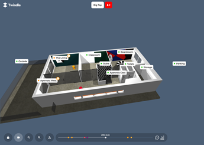
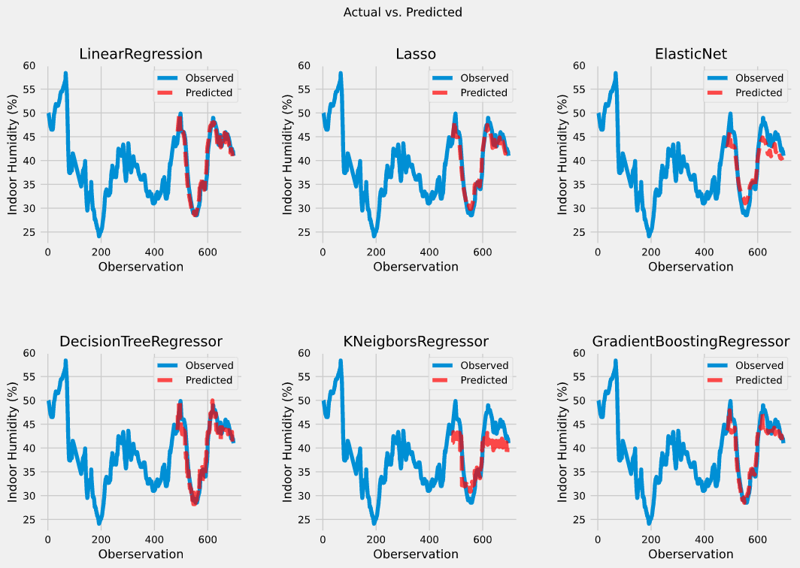
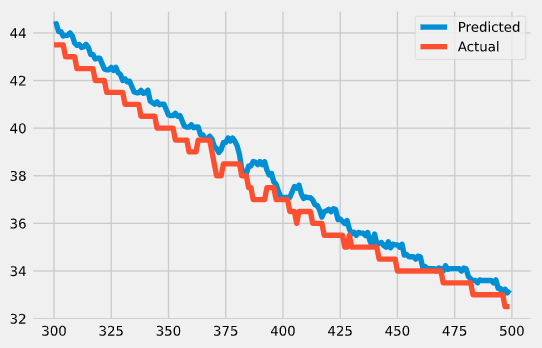

# Welkom bij de blog

Op deze pagina zal per week worden besproken welke taken er op de planning stonden, hoe deze zijn aangepakt, eventuele uitdagingen en een planning voor de volgende week.

##Week 1
**08-02-2021 t/m 12-02-2021**  
Deze week ben ik gestart met mijn stageproject. Dit houdt in dat ik vooral bezig ben geweest met het projectplan. Daarnaast heb ik deze week ook toegang gekregen tot een kopie van de database.

**Projectplan** 
Deze week was het doel om de kern het projectplan te beschrijven. Dit betekent dat ik veel aandacht heb besteed aan het opstellen van een doel & hoofd- en deelvragen. Momenteel luidt de hoofdvraag:

> Hoe kan machine learning waarde toevoegen voor Twindle-gebruikers?

Om te helpen met het bepalen van het hoofddoel heb ik van Sjoerd een concept afbeelding ontvangen. Hierin wordt het toekomstbeeld van de Twindle weergegeven.

Op deze afbeelding is een tijdlijn te zien waarin toekomstige waarschuwingen worden gevisualiseerd. Volgende week ga ik, door middel van een stakeholders analyse, uitzoeken wie de gebruikers zijn en wat zij graag aan de Twindle toegevoegd zien worden. Aan de hand van deze analyse kan ik het doel specifieker maken.

**Database**  
Om een vlotte start te kunnen maken moet ik zo snel mogelijk toegang krijgen tot de database. Gelukkig kreeg ik dinsdag al een kopie van de database. Er was een kleine uitdaging met deze database, het is een document-based database.

Aangezien ik data analyseer in Python notebooks door gebruik te maken van, onder andere, Pandas DataFrames moest ik hier een adapter voor schrijven. Dit bleek een veel voorkomend probleem en was binnen een uur opgelost.

Volgende week of de week daarna verwacht ik aan de Exploratory Data Analyse te beginnen. De resultaten van deze analyse zullen gebruikt worden om te kijken of de gestelde doelen realistisch zijn.

##Week 2
**15-02-2021 t/m 19-02-2021**  
Zoals vorige week afgesproken was heb ik deze week gewerkt aan een stakeholders analyse en het project plan. De volgende vooruitgang is hierin gemaakt.

**Stakeholders analyse**  
De bedoeling was om een stakeholders analyse uit te voeren om de relevante partijen voor het project in kaart te brengen. Gebaseerd hierop kon een communicatieplan opgesteld worden. Dit is goed gelukt.

In eerste instantie had ik had management van Postillion hotels in de hoogste categorie geplaatst. Na feedback van Sjoerd heb ik deze verwisseld met de personen van Techtenna. Volgende week ga ik deze personen uitnodigen voor een story mapping sessie en deze sessie voorbereiden.

**Project plan**  
Deze week wilde ik de doelstelling verduidelijken. Dit heb ik gedaan door de SMART-methode toe te passen. Hieruit kwamen twee doelstellingen; Een die gericht was op energiebesparing en een andere voor luchtkwaliteit. Uiteindelijk heb ik na feedback van Samet ervoor gekozen om de focus te leggen op het luchtkwaliteit gedeelte.

De eerste versie van het project plan is nu af. Ik heb het opgestuurd naar mijn docent Bartosz voor feedback. Ik verwacht in de loop van volgende week deze feedback te ontvangen en toe te passen.

##Week 3
**22-02-2021 t/m 26-02-2021** 
Deze week stond in het teken van de story mapping sessie en exploratory data analysis.

**Story mapping**  
Aan de hand van de stakeholders analyse heb ik een voorbereiding gemaakt voor de story mapping ingepland. Deze zal volgende week dinsdag, twee maart, plaatsvinden. Hiervoor heb ik de digitale omgeving die tijdens de sessie gebruikt gaat worden alvast ingericht.

Het resultaat van de story mapping zal een backlog zijn. Gebaseerd op deze backlog kan ik de verdere sprints inplannen.

**Exploratory Data Analysis**  
Vorige week was ik begonnen met het ontwikkelen van een adapter om de database uit te lezen. Deze was nog niet goed genoeg. Ik heb het uitgebreid met een pipeline die de data opdeelt in de evenementen waarin ze opgeslagen worden een aan de hand van de timestamps aan elkaar verbonden. Dit resulteert in een net dataframe met minimale NaN-waarden.

Hierna was ik begonnen aan de exploratory data analyse. Hieruit kwamen de volgende inzichten.

1. Veel outliers.
2. Correlatie verschil tussen ruimten.
3. Gemeten data verschilt per ruimte.

Volgende week wil ik eventuele oplossingen voor deze uitdagingen bespreken met met mijn technisch begeleider.

##Week 4
**01-03-2021 t/m 05-03-2021** 

Deze week is er een nieuwe sprint begonnen. Het doel van deze sprint is om de data requirements op te stellen, de data te verzamelen en voor te bereiden om machine learning modellen te trainen. Deze week is aan de volgende onderdelen gewerkt; Story mapping, data requirements onderzoek en projectplan

**Story mapping** 
Vorige week was ik begonnen om de story mapping sessie voor te bereiden. Deze week was er een afspraak gepland om deze sessie te houden. Samen met Jeroen & Marco van Techtenna hebben we besproken wat de richting van het project gaat worden. De bedoeling was dat hier een complete backlog uit kwam. Momenteel zijn het alleen nog "epics". Volgende week maandag wil ik bespreken welke concrete taken hierbij horen.

**Data requirements onderzoek** 
Aan de hand van de exploratory data analyse heb ik een data requirements analyse uitgevoerd. Hierbij heb ik gekeken of verschillende modellen die moeten gaan worden ontwikkeld worden al door andere zijn ontwikkeld. Hiervoor heb ik een viertal raporrten gevonden waarop ik een "data-boodschappenlijst" heb kunnen samenstellen. De komende week hoop ik alle items van dit lijstje af te kunnen strepen.

**Projectplan** 
Op maandag had ik feedback ontvangen over mijn projectplan van Bartosz. Dit had ik opgedeeld in onderdelen zodat ik op donderdag of vrijdag alle onderdelen verwerkt zou hebben. Ik heb mezelf aan deze planning kunnen houden en de tweede versie van het plan is nu af. Deze ga ik op sturen voor feedback of goedkeuring. Volgende week verwacht ik dit afgerond te hebben.

##Week 5
**08-03-2021 t/m 12-03-2021** 
Deze week ben ik begonnen met het verzamelen van data uit externe bronnen. Daarnaast heb ik het projectplan afgerond.

**Dataverzameling** 
Vorige week was ik geëindigd met het samenstellen van een "data-boodschappenlijstje". Het doel was alle items deze week te verzamelen. In de meeste gevallen is dit gelukt. Zo heb ik bijvoorbeeld een bouwtekening van het kantoor ontvangen waaruit ik de oppervlakte van de ruimten heb gehaald.

Er is veel meteorologische data benodigd. De grootste bron hiervan is het KNMI. Zij stellen een API beschikbaar waar accurate data over constante tijdsintervallen opgehaald kunnen worden. Het probleem is dat er momenteel technische problemen zijn met deze API waardoor hij niet beschikbaar is. Een oplossing die ik hier voor gevonden heb ik om historische data te downloaden en koppelen aan de data de vanuit Twindle verzameld wordt. Voor nu werkt dit en kan ik verder met het ontwikkelen van de machine learning modellen.

**Machine learning modellen** 
Aangezien de data verzameling voorspoediger verliep dan verwacht kon ik een week eerder aan de machine learning model ontwikkeling beginnen. Ik heb er voor gekozen om te beginnen met relatief simpele lineaire regressie modellen. Hiermee heb ik al accurate resultaten kunnen bereiken zoals in de onderstaande afbeelding te zien valt.

Volgende week wil ik voor de andere meetwaarden dezelfde techniek toepassen en kijken of het net zo goed werkt.

**Projectplan**  
Deze week was de deadline voor het projectplan. Bartosz had nog wat kleine aanmerkingen. Deze heb ik verwerkt en zal ik volgende week of de week daarop bespreken.

##Week 6
**15-03-2021 t/m 19-03-2021** 
Deze week was er een nieuwe sprint begonnen. Het doel van deze sprint is om een eerste prototype van de modellen op te leveren.

**Linear Regression** 
Vorige week ben ik begonnen met het ontwikkelen van linear regression modellen. De eerste indruk was dat deze goed presteerde. Ik was wat achterdochtig over de 0.997 R2 score die de modellen behaalde en heb dat verder onderzocht. Het bleek dat de data seizoensgebonden en autocorrelaties bevat. Dit maakt traditionele regressie modellen ongeschikt.

Zoals in de bovenstaande afbeelding resulteerd dit soort data in modellen die altijd de waarden van t-1 weergeven. In R2 scores en dergelijke lijkt het te werken maar uiteindelijk bevat het model geen voorspellende capaciteiten.

**Time Series Prediction** 
Na wat onderzoek te hebben gedaan ben ik uit gekomen op time series prediction. Dit is iets waar ik nog nooit eerder mee heb gewerkt en wat aardig complex is. Momenteel heb ik de data verder onderzocht op seizoensgebondenheid, autocorrelatie en trends. Vanuit hier wil ik volgende week met technieken zoals ARIMA aan de slag om modellen te ontwikkelen.

##Week 7
**22-03-2021 t/m 26-03-2021** 
vorige week was ik tot de conclusie gekomen dat mijn lineare regressie modellen geen voorspellende waarde hadden. Deze week heb ik verder onderzoek gedaan naar time series prediction en de volgende drie model soorten uitgeprobeerd; Linear regression, Exponential Smoothing & ARIMA.

Voor ik begin met de experimenten had ik vastgesteld dat modellen beoordeeld worden op R2 score. Een model moet een **minimale R2 score van 0.90** halen om als goed beschouwd te worden.

**Linear Regression**  
Omdat de data erg sterke autocorrelaties bevat heb ik de keuze gemaakt om in plaats van de echte waarde te voorspellen het verschil tussen twee punten te voorspellen. De modellen die ik hier mee ontwikkeld heb komen niet boven de 0.30 R2 score uit en zijn dus niet goed genoeg. Waarschijnlijk mis ik nog belangrijke features die leiden tot een verandering in de meetwaarde.

**Exponential Smoothing & ARIMA**  
Deze technieken werkte beide redelijk goed maar haalde het gestelde doel niet. Cross-validation moet toegepast worden om te bepalen hoe goed het model echt presteert.

Volgende week wil ik beginnen met het ontwikkelen van de integratie van de modellen in Twindle. Hiervoor zal ik beginnen met een ontwerp maken wat ik daarna bespreek met mijn technisch begeleider. Parallel hieraan wil ik de modellen verder verbeteren. De eerste stap hierin is om meer data te verzamelen die invloed kan hebben op veranderingen in de meetwaarde.

##Week 8
**29-03-2021 t/m 02-04-2021** 
Deze week was er een nieuwe sprint begonnen. Deze sprint stond in het teken van het ontwerpen en ontwikkelen van de integratie van de machine learning modellen in de bestaande Twindle applicatie.

**Ontwerp**  
De koppeling van de machine learning modellen is ontworpen volgend het C4 model. Op deze manier kan van een hoog tot laag abstractie niveau gewerkt worden. Het belangrijkste aan dit ontwerp is dat de machine learning modellen perdiodiek geüpdatet moeten worden met nieuwe data. Hiervoor is goed nagedacht over de communicatie met de API van de Twindle applicatie. De eerste versie van het ontwerp is afgerond. Volgende week zal ik met mijn technisch begeleider dit ontwerp bespreken, aanpassingen maken en beginnen met de implementatie.

**Planning**  
Het plan was om deze sprint de applicatie te ontwerpen en te implementeren. Waarschijnlijk is deze planning te optimistisch. Zoals het er nu voor staat zal er volgende week donderdag begonnen worden aan de implementatie. Een extra sprint zal benodigd zijn om deze af te ronden. Tijdens het opstellen van het project plan is rekening gehouden dat deze situatie zich voor kon doen.

##Week 9
**05-04-2021 t/m 02-04-2021**  
Vorige week was vastgesteld dat er een extra sprint benodigd was om de applicatie te kunnen implementeren. Deze week is verder gewerkt aan het ontwerp. Daarnaast is er een oplevering geweest voor Techtenna waar een verandering van het doel is besproken.

**Ontwerp**  
Vorige week was een groot gedeelte van het ontwerp afgerond. Deze week is dit met Samet besproken. Er moest nog meer verduidelijkt worden over de database, het was nog niet duidelijk wat voor soort database toegepast ging worden en met welke technieken. Hier is verder onderzoek naar gedaan waarvan de conclusie was dat er een MySQL database gebruikt gaat worden. 

Momenteel is er een andere stagiaire, Dmitri, ook bezig aan uitbreidingen van de Twindle applicatie. Samen met hem is het ontwerp besproken om ervoor te zorgen dat we elkaar niet tegenwerken.

**Oplevering & doelwijziging**  
Na aanleiding van de storymapping sessie in week vier was er besloten iedere maand een update te geven aan de personen van Techtenna. Hiervoor was er een presentatie voorbereid waarin de bevindingen van de machine learning experimenten en het ontwerp werden besproken. Tijdens het ontwerpen van de applicatie stuiten ik op meerdere artikelen waarin verteld werd dat een groot gedeelte van de machine learning projecten nooit afgerond word.

Dit komt doordat het proces wat gebruikt wordt om machine learning modellen te ontwikkelen niet per se goed aansluit bij software- en DevOps processen. Hierdoor had ik voorgesteld om in plaats van voor de drie service lagen modellen te ontwikkelen de focus te leggen op de luchtkwaliteit modellen. Zo kan ik een systeem ontwikkelen wat ervoor zal zorgen dat de machine learning modellen continu worden geüpdatet met de nieuwste data en bijgestuurd kunnen worden waar nodig.

Dit voorstel werd positief ontvangen door mijn stagebegeleiders en Marco van Techtenna. Het ontwerp is nu afgerond en goedgekeurd en zal de komende twee weken worden geimplementeerd.

##Week 10
**12-04-2021 t/m 16-04-2021**  
Vorige week was het ontwerp van mijn applicatie goedgekeurd. Het bestaat uit drie onderdelen, ML API, Twindle front-end en Twindle back-end. Deze week is gewerkt aan het eerste onderdeel, de ML API.

**Pipeline** 
Het proces wat nu in de notebooks gebruikt wordt om de ARIMA modellen te maken moest worden omgezet naar een geautomatiseerde pipeline. Hiervoor heb ik een modules gemaakt die data kan opvragen uit het Twindle back-end, deze data kunnen voorbereiden en de modellen kunnen updaten en daarna opslaan in een database. Hierbij liep ik tegen het probleem aan dat de .pkl bestanden ~1.5 GB per stuk waren. Dit bleek te groot te zijn om in een SQL database op te slaan. Na wat onderzoek te doen en mogelijkheden te bespreken heb ik besloten om het pad naar de bestanden op te slaan i.p.v. de complete modellen.   

**API** 
De forecasts die gemaakt worden na het updaten van de modellen moeten kunnen worden opgevraagd via een API. Hiervoor heb ik de Flask library toegepast. Ik verwachte dat dit een redelijk simpel proces was aangezien ik maar 1 endpoint hoefde te ontwikkelen. Aangezien ik niet veel ervaring heb met het ontwikkelen van applicaties in Python ging dit wat minder soepel dan verwacht. Uiteindelijk is het me gelukt om dit endpoint toe te voegen. De manier waarop ben ik alleen nog niet helemaal tevreden over. Volgende week maandag heb ik een technische bespreking met Samet waarin ik, onder andere, dit wil aankaarten.  
