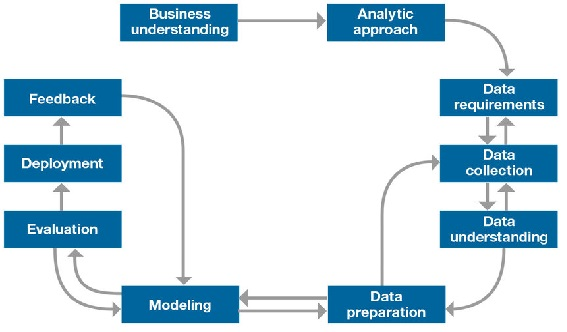

# Introductie
Tijdens het achtste semester van de studie ICT & Software engineering zal mijn afstudeerstage
plaatsvinden bij Handpicked Agencies. Het project waar ik aan zal werken is de digital twin
genaamd [Twindle](https://demo.twindle.io/). Dit product is vorig jaar ontwikkeld door [Handpicked Labs](https://labs.handpickedagencies.com/) in samenwerking
met [Techtenna](https://techtenna.com/). Het doel van de applicatie was om de luchtkwaliteit, energieverbruik en
brandveiligheid van gebouwen in kaart te brengen door middel van een digitale kopie van het
gebouw.

Twindle meet, onder andere, de temperatuur, luchtvochtigheid en CO2 en bepaalt of er voldaan
wordt aan de gestelde luchtkwaliteitseisen. Mede door COVID-19 is de luchtkwaliteit in een
ruimte steeds belangrijker geworden. Slechte luchtkwaliteit kan ernstige gezondheidsproblemen
veroorzaken. Door dit project uit te voeren willen we de leefbaarheid van ruimtes verbeteren.

## Probleemstelling
Momenteel wordt er veel data verzameld door Twindle die betrekking heeft op de luchtkwaliteit.
Dit zijn meetwaarden zoals temperatuur, CO2, luchtvochtigheid en dergelijke. Het doel is om
voor deze meetwaarde een voorspellend model te ontwikkelen zodat slechte luchtkwaliteit
voorkomen kan worden.

## Doelstelling

> ***Vanaf 18-06 zullen de gebruikers van Twindle meldingen kunnen ontvangen wanneer slechte luchtkwaliteit wordt verwacht. Het machine learning model wat hiervoor wordt toegepast zal een “recall’ en “precision” score hebben van minimaal 95%.***

Een verdere beschrijving van het doel kan in hoofdstuk *1.2.1 SMART* [^1] van het projectplan gevonden worden. 

## Planning
Tijdens het project zal er gewerkt worden in sprint van twee weken. Om het project te structureren zal de IBM Data Science methodology toegepast worden, zie onderstaande afbeelding. Per sprint zal vermeld worden welke onderzoeken [^2] en producten [^3] opgeleverd zullen worden. 

_Afbeelding 1: IBM Data Science Methodology_

|#  | Fase      | Onderzoeken                                       | Producten                             | Start | Eind  |
| :-| :---------| :-----------                                      | :-----------                          | :-----| :-----|
|0. | Opstart   |                                                   | Projectplan                           | 08-02 | 12-02 |
|1. | 1         | Exploratory data analyse    Stakeholdersanalyse| EDA   Backlog                      | 15-02 | 26-02 |
|2. | 2         | Data requirements analyse                         | Data requirements report   Dataset | 01-03 | 12-03 |
|3. | 3 - 4     | Modellering experimenten                          | Model prototype                       | 15-03 | 26-03 |
|4. | 5         | ML Pipeline ontwerp                               | Ontwerpdocument                       | 29-03 | 09-04 |
|5. | 5         | Model integratie                                  | Prototype                             | 12-04 | 23-04 |
|6. | 1 - 2     | Model evaluatie   EDA                          | Dataset versie 2                      | 26-04 | 07-05 |
|7. | 3 - 4     | Model experimenten                                | ML modellen versie 2                  | 10-05 | 21-05 |
|8. |           |                                                   |                                       | 24-05 | 04-06 |
|9. |           |                                                   |                                       | 07-06 | 18-06 |

## Leeswijzer
Tijdens het afstuderen zal er gewerkt worden aan de ICT competenties zoals beschreven in de [HBO-I domeinbeschrijving](https://hboidomein-212218.appspot.com/pdf?template=https://hboidomein-212218.appspot.com/template.html&deep=true&full=true&lang=NL&skipcache=&viewport=1156x818&url=https://hboidomein-212218.appspot.com/pdfdoc). Per competentie zal een korte toegelichting geven worden en beschreven worden welke manier deze verwerkt is in het portfolio.   

**Analyseren**  

- Stakeholders
- Requirements

### Ontwerpen

- Architectuur

### Realiseren

- Manier van aanpak
- Prototype
- Proof of concept

### Adviseren

- Aanpak & scope
- Volgende stappen

### Onderhouden

- Versie beheer
- Planning
- Feedback

### Blog

[^1]: [Projectplan 1.2.1 SMART](./pdfs/project_plan.pdf#page=8) *blz. 8 - 9*
[^2]: [Projectplan 1.4 Onderzoeksvragen](./pdfs/project_plan.pdf#page=12) *blz. 12 - 15*
[^3]: [Projectplan 1.5 Eindproducten](./pdfs/project_plan.pdf#page=8) *blz. 16 - 17*

