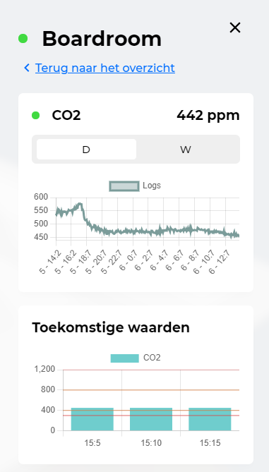

## Introductie

Tijdens het achtste semester van de studie ICT & Software Engineering heeft mijn afstudeerstage bij Handpicked Agencies plaatsgevonden. Het project waar ik aan gewerkt heb is de digital twin genaamd [Twindle](https://demo.twindle.io/).

Dit product is vorig jaar ontwikkeld door [Handpicked Labs](https://labs.handpickedagencies.com/) in samenwerking met [Techtenna](https://techtenna.com/). Het doel van de applicatie was om de luchtkwaliteit, energieverbruik en brandveiligheid van gebouwen in kaart te brengen door middel van een digitale kopie van het gebouw.

### Probleemstelling

Twindle meet, onder andere, de temperatuur, luchtvochtigheid en CO2 en bepaalt of er voldaan wordt aan de gestelde luchtkwaliteitseisen. Mede door COVID-19 is de luchtkwaliteit in een ruimte steeds belangrijker geworden. Slechte luchtkwaliteit kan ernstige gezondheidsproblemen veroorzaken. Door de luchtkwaliteit te voorspellen en meldingen te maken wanneer deze in gevaar is willen we de leefbaarheid van ruimten verbeteren.

### Hoofd- en deelvragen

Tijdens het gehele project is onderzoek verricht worden volgens het [Development Oriented Triangulation (DOT) framework](https://ictresearchmethods.nl/The_DOT_Framework). Dit framework bestaat uit verschillende onderzoekscategorieën die gecombineerd moeten worden om tot een valide conclusie te komen.

Om het onderzoek te structureren is er een hoofdvraag en meerdere deelvragen opgesteld. Tijdens de conclusie zullen deze hoofd- en deelvragen beantwoord worden.

**Hoofdvraag**  

> **_Hoe kan Twindle uitgebreidt worden om een hoge luchtkwaliteit in ruimten te garanderen?_**

**Deelvragen**  
Onderstaand zijn de deelvragen opgesomd. In het projectplan is een overzicht[^1] te vinden waarin wordt toegelicht welke onderzoeksmethoden gebruikt zijn om de vraag te beantwoorden.

- Wie zijn de gebruikers van Twindle?
- Welke data is benodigd om luchtkwaliteit te voorspellen
- Hoe kan machine learning worden toegepast om luchtkwaliteit te voorspellen?
- Met welke ethische aspecten dient rekening gehouden te worden? En op welke manier?
- Hoe kunnen machine learning modellen gekoppeld worden aan Twindle?

### Doelstelling

> **_Vanaf 18-06 zullen de gebruikers van Twindle meldingen kunnen ontvangen wanneer slechte luchtkwaliteit wordt verwacht. Het machine learning model wat hiervoor wordt toegepast zal een "recall" en "precision" score hebben van minimaal 90%._**

Een verdere beschrijving van het doel kan in hoofdstuk _1.2.1 SMART_ [^2] van het projectplan gevonden worden.

### Behaalde resultaten

Uiteindelijk is er een pipeline ontwikkeld die periodiek bekijkt of de machine learning modellen geupdated moeten worden en voorspellingen maakt. Via een API is deze applicatie gekoppeld aan Twindle. Onderstaand valt een voorbeeld van deze koppeling te zien.

<small>Afbeedling 1: Voorbeeld van koppeling
</small>

Door deze manier van visualizatie toe te passen worden gebruikers aangespoort om in te grijpen wanneer de situatie dreigt te verslechteren. 

## Leeswijzer

Tijdens het afstuderen is gewerkt aan de ICT competenties zoals beschreven in de [HBO-I domeinbeschrijving](https://hboidomein-212218.appspot.com/pdf?template=https://hboidomein-212218.appspot.com/template.html&deep=true&full=true&lang=NL&skipcache=&viewport=1156x818&url=https://hboidomein-212218.appspot.com/pdfdoc). In de onderstaande secties zal per competentie kort samengevat worden hoe deze aangetoond is.

### Analyseren

Voordat begonnen was aan het ontwikkelen van het product was het belangrijk om te weten wie er bij betrokken waren en wat zij belangrijk vonden. Hiervoor is tijdens het opstellen van het project is de volgende vraag gesteld:

> **_Wie zijn de gebruikers van Twindle?_**

Door middel van een [stakeholders analyse](analyseren.md#stakeholders-analyse) is deze vraag beantwoord. Hierna is verder onderzocht wat de behoeften van deze stakeholders waren door gebruik te maken van [story mapping technieken](analyseren.md#story-mapping).

Daarnaast werd er geanalyseerd welke data de Twindle applicatie tot nu toe heeft verzameld in een [exploratory data analyse](analyseren.md#exploratory-data-analyse). De resultaten van deze analyses zijn verwerkt in requirements. Deze zijn opgesplitst in de volgende categorieën:

- [Software](analyseren.md#software-requirements)
- [Data](analyseren.md#data-requirements)
- [Machine learning](analyseren.md#machine-learning-requirements)

Deze requirements onderzoeken hebben geleidt tot een antwoord op de vraag:

> **_Welke data is benodigd om luchtkwaliteit te voorspellen?_**

### Ontwerpen

Uit de verschillende analyses was gebleken dat het belangrijk is dat personen snel geinformeerd worden wanneer de luchtkwaliteit dreigt te verslechteren. De eerste stap hierin is om de meetwaarden die samen de luchtkwaliteit vormen te voorspellen. Hiervoor is de volgende vraag gesteld:

> **_Hoe kan machine learning worden toegepast om luchtkwaliteit te voorspellen?_**

Tijdens de [model experimenten](ontwerpen.md#model-experimenten-versie-1) zijn meerdere machine learning technieken onderzocht en getest om een antwoord op deze vraag te kunnen geven.

De tweede stap was om een systeem te ontwerpen waardoor de machine learning modellen up-to-date blijven, periodiek nieuwe voorspellingen maken en deze toegankelijk maken voor, bijvoorbeeld, front-end applicaties. Dit ontwerp geeft antwoord de de vraag:

> **_Hoe kunnen machine learning modellen gekoppeld worden aan Twindle?_**

Na het ontwerp te hebben geïmplementeerd was dit [opgeleverd](realiseren.md#oplevering-2-integratie-arima-modellen). Hieruit bleek dat er meerdere problemen waren met de machine learning modellen die opgelost moesten worden. Hiervoor is een [tweede iteratie](ontwerpen.md#model-experimenten-versie-2) van de model experimenten gedaan.

### Realiseren  

Om het ontwerp te realiseren was iteratief gewerkt. Iedere vier weken heeft er een oplevering plaatsgevonden voor de stakeholders van Handpicked Labs en Techtenna.

Tijdens de [eerste oplevering](realiseren.md#oplevering-1-ontwerp) was het ontwerp besproken met de stakeholders, zij waren allemaal akkoord met de beslissingen die daar gemaakt werden.

Daarnaast werd voorgesteld om het doel te wijzigen. Tot dit moment in het project was het doel om voor alle servicelagen (luchtkwaliteit, duurzaamheid en brandveiligheid) machine learning modellen te ontwikkelen. Voorgesteld was om de focus te leggen op de luchtkwaliteit, daar een robuust systeem voor te bouwen en daarna uit te breiden naar de rest van de servicelagen. De stakeholders gingen hiermee akkoord.

Hierna was tijdens de [tweede oplevering](realiseren.md#oplevering-2-integratie-arima-modellen) het resultaat van de ARIMA modellen gepresenteerd. Hier bleken nog enkele problemen mee te zijn:

1. Voorspellingen waren op een te kort termijn
2. Modellen waren te groot (> 1GB)
3. Voorspelligen waren niet accuraat genoeg.

Het doel was om deze problemen om te lossen voor de [derde oplevering](realiseren.md#oplevering-3-iteratie-op-integratie). Hiervoor was een tweede iteratie van de [model experimenten](ontwerpen.md#model-experimenten-versie-2) uitgevoerd wat resulteerde in verbeterde modellen. Deze loste de problemen van de voorgaande oplevering op en de stakeholders waren tevreden over de gemaakte veranderingen.

### Beheer  

Om het project in goede banen leiden is tijdens het opstellen van het plan[^5] uitgelegt hoe het project beheert zou worden. In dit onderdeel van het portfolio wordt toegelicht hoe dit in de realiteit verlopen is.

Door middel van [versie beheer](beheer.md#versiebeheer) toe te passen wordt het aantal merge conflicten geminimaliseerd. Samen met [automatische tests](beheer.md#automatishe-tests) vormt dit de basis voor het [continous deployment](beheer.md#deployment) systeem.

### Adviseren  

Na afloop van het project is er [teruggekeken](realiseren.md#algemene-evaluatie-reflectie) op wat er goed ging en wat er beter kon. Vanuit deze bevindingen zijn adviezen uitgebracht over de volgende onderwerpen

1. [Data](adviseren.md#data)
2. [Workflow](adviseren.md#workflow)
3. [Ethiek](adviseren.md#ethiek)

Door de ethische aspecten van het project te analyseren is antwoord gegeven op de volgende vraag:

> **_Met welke ethische aspecten dient rekening gehouden te worden? En op welke manier?_**

## Conclusie

Ter conclusie zal bepaalt worden of aan het doel voldaan is door de hoofd- en deelvragen te beantwoorden en te reflecteren op de stageperiode. Het doel van het project was:

> **_Vanaf 18-06 zullen de gebruikers van Twindle meldingen kunnen ontvangen wanneer slechte luchtkwaliteit wordt verwacht. Het machine learning model wat hiervoor wordt toegepast zal een "recall" en "precision" score hebben van minimaal 90%._**

**Wie zijn de gebruikers van Twindle?**  
Door gebruik te maken van een stakeholdersanalyse is bepaalt dat de gebruikers van twindle in twee groepen vallen; Gebouwbeheerders en gebouwgebruikers.

**Welke data is benodigd om luchtkwaliteit te voorspellen**  
Om te bepalen welke data benodigd is voor de voorspellingen was gezocht naar onderzoeken die hetzelfde onderwerp betreffen. Hieruit is gebleken dat de oppervlakte van ruimten, het bouwjaar, verwarmingsinstellingen, raamstand, buitentemperatuur, luchtvochtigheid en zonnestraling benodigd zijn. Aangezien deze nog niet aanwezig zijn in de dataset zijn deze verzameld\*

**Hoe kan machine learning worden toegepast om luchtkwaliteit te voorspellen?**  
Door twee iteraties model experimenten uit te voeren is bevonden dat door `ridge regression` toe te passen de luchtkwaliteit op korte termijn, tot 15 minuten in de toekomst, valt te voorspellen. Een model wat op langere termijn effectief is was niet gevonden. De oplossing hiervoor is om gemiddelden waarden voor bepaalde dagen en tijdstippen te gebruiken als voorspelling.

**Met welke ethische aspecten dient rekening gehouden te worden? En op welke manier?**  
Het Twindle project wordt al aan hoge standaarden wat betreft privacy en dataverzameling gehouden. Het is belangrijk dat bij uitbreiding van het project, vooral de brandveiligheid servicelaag, deze standaarden aangehouden worden.

**Hoe kunnen machine learning modellen gekoppeld worden aan Twindle?**  
Een groot gedeelte van de machine learning projecten faalt omdat de modellen niet goed up-to-date gehouden kunnen worden. Om dit te voorkomen is een pipeline ontwikkeld die periodiek de modellen update en nieuwe voorspellingen maakt. Via een API is dit gekoppeld aan Twindle.

<small>\*Alleen indien er een model ontwikkeld is voor de desbetreffende meetwaarden</small>

### Evaluatie & reflectie

Om te bepalen of het doel behaalt is zal op de STARR methode[^6] gereflecteerd worden op de gehele stageperiode.

**Situatie**  
Tijdens de periode van 08-02-21 tot 09-07-2021 heb ik stage gelopen bij Handpicked Labs. Het doel moest bereikt zijn op 18-06-2021. Gedurende deze periode heb ik gewerkt aan het Twindle project. Hierbij werd ik begeleid door Sjoerd van Oosten, conceptueel, en Samet Yilmaz, technisch.

**Taak**  
Het was aan mij om een applicatie te ontwerpen en ontwikkelen waarmee gebruikers van Twindle meldingen konden ontvangen wanneer de luchtkwaliteit in gevaar was. Dit omdat luchtkwaliteit een steeds groter probleem is in ruimten, en we personen willen beschermen tegen de gevolgen van slechte luchtkwaliteit.

**Actie**  
Dit probleem heb ik opgelost door de volgende onderdelen te realiseren:

1. Machine learning modellen die de CO2-waarden in een bepaalde ruimte voorspellen.
2. Een pipeline die deze modellen up-to-date houdt en regelmatig nieuwe voorspellingen maakt.
3. Een front-end uitbreiding waar deze voorspellingen worden gevisualiseerd.

**Resultaat**  
Deze onderdelen resulteren in een systeem wat nauwkeurige voorspellingen kan maken en deze op een manier visualiseert zodat personen aangespoort worden de situatie te verbeteren. Het andere gedeelte van het doel, het weergeven van meldingen, is wegens tijdgebrek en complicaties tijdens het ontwikkelen niet gerealiseerd.

**Reflectie**  
Ik vind dat door meerdere iteraties uit te voeren en de feedback te verwerken er een passende oplossing voor het probleem is gevonden. Wel is het zo dat ik het teleurstellend vind dat het meldingensysteem niet is geimplementeerd.

Ik denk dat ik te snel aan het ontwikkelen van de machine learning modellen ben begonnen. Het zou waarschijnlijk beter zijn geweest als ik eerst een proof of concept zou hebben gemaakt waarin de visualisaties en meldingen getoond werden. Vanaf hier had ik sneller de juiste modellen kunnen ontwikkelen.

Ook had ik onderschat hoeveel tijd het kostte om de pipline en front-end veranderingen te realiseren. Origineel had ik een sprint ingepland voor het ontwerpen en realiseren van de applicatie. Uiteindelijk heb ik hier ongeveer drie sprints aan besteed. Tijdens de planningsfase van volgende projecten kan ik hier rekening mee houden.

[^1]: [Projectplan 1.4.1 & 1.4.2](./pdfs/project_plan.pdf#page=13) _blz. 13 - 15_
[^2]: [Projectplan 1.2.1 SMART](./pdfs/project_plan.pdf#page=8) _blz. 8 - 9_
[^3]: [Projectplan 1.4 Onderzoeksvragen](./pdfs/project_plan.pdf#page=12) _blz. 12 - 15_
[^4]: [Projectplan 1.5 Eindproducten](./pdfs/project_plan.pdf#page=8) _blz. 16 - 17_
[^5]: [Projectplan: 4 Testaanpak en Configuratiemanagement](pdfs/project_plan.pdf#page=23) _blz. 23 t/m 25_
[^6]: [Scribbr: Reflecteren met de STARR-methode](https://www.scribbr.nl/stage/starr-methode/)
