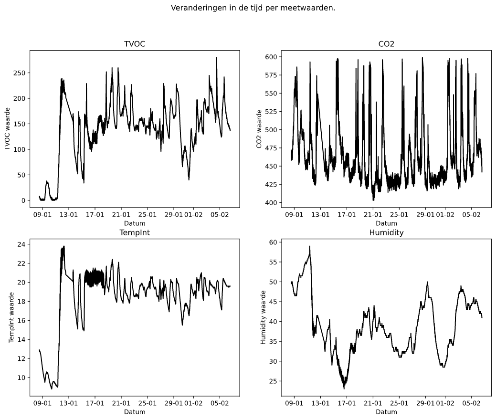
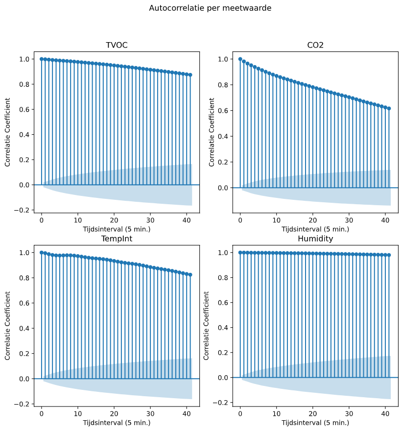
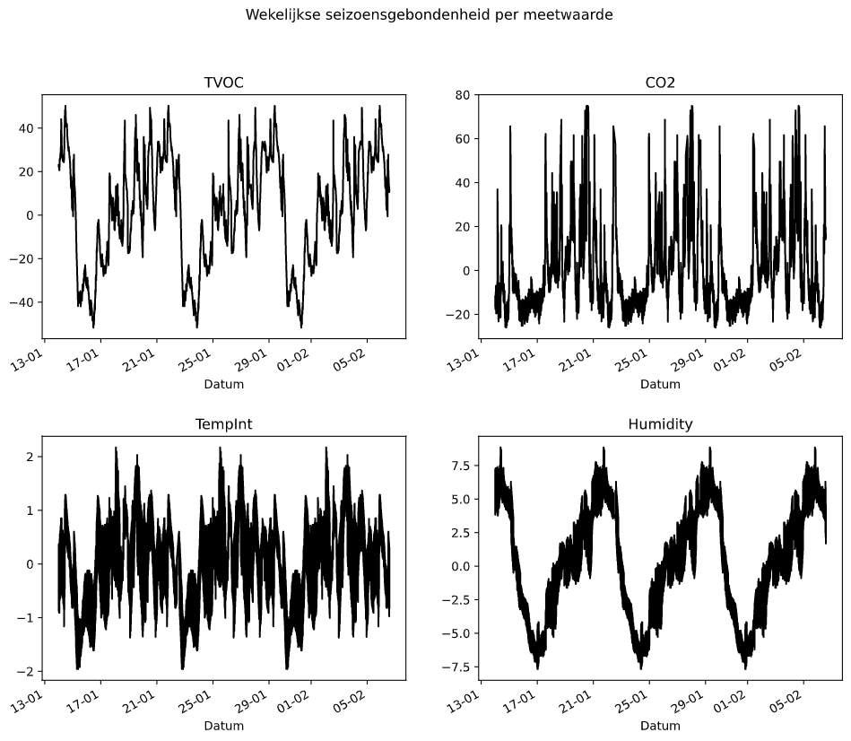
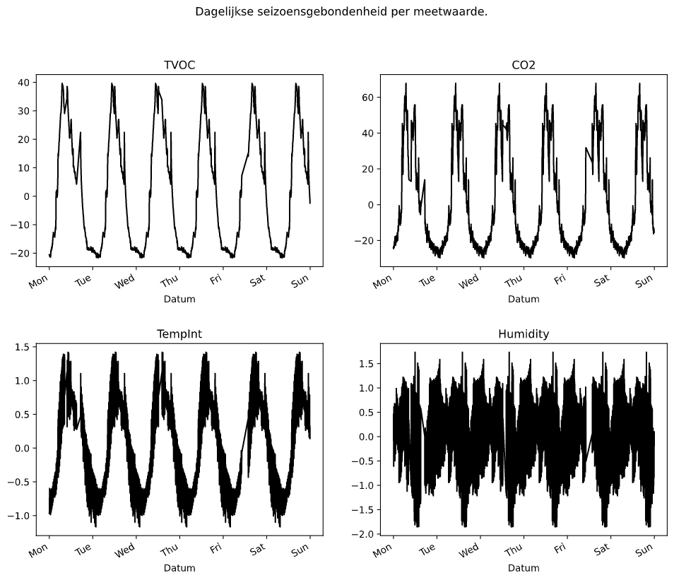

## Model experimenten versie 1

Voor de uitbreiding van het Twindle project zullen machine learning modellen gebruikt worden om de luchtkwaliteit te voorspellen. Dit zullen modellen zijn voor luchtvochtigheid, temperatuur, CO2 en TVOC. Het rapport van deze model experimenten kan gevonden worden in _bron 1: Model experimenten versie 1_.

### Gegevens

Om te bepalen welke doelen, evaluatiemethoden en modellen toegepast kunnen worden zullen de patronen in de luchtvochtigheid, temperatuur, CO2 en TVOC verder onderzocht worden.

Aangezien deze waarden tijdreeksen zijn zullen de patronen onderzocht worden door middel van, onder andere, tijdreeksgrafieken, scatterplots en correlelogrammen

*Afbeelding 1: Meetwaarden in de tijd*

*Afbeelding 2: Autocorrelatie per meetwaarde*

*Afbeelding 3: Wekelijkse seizoensgebondenheid*

*Afbeelding 4: Dagelijkse seizoensgebondenheid*

### Eisen

### Beschrijving

### Beoordeling

### Conclusie

## Architectuur

## Model experimenten versie 2

[^1]: [Model experimenten rapport: versie 1](pdfs/model_experimenten_v1.pdf)
