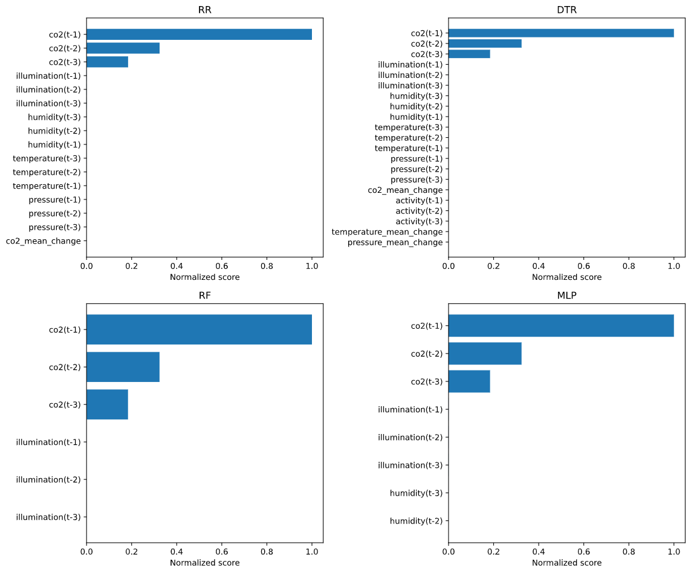

## Model experimenten versie 1

Voor de uitbreiding van het Twindle project zullen machine learning modellen gebruikt worden om de luchtkwaliteit te voorspellen. Dit zullen modellen zijn voor luchtvochtigheid, temperatuur, CO2 en TVOC. Deze modellen moeten voldoen aan bepaalde eisen, welke besproken worden in het [analyseren: requirements - machine learning](analyseren.md#machine-learning-requirements) onderdeel.

### Beschrijving & resultaten

Om een betere indicatie te krijgen wat voor soort modellen toegepast kunnen worden is extra data exploratie verricht[^1]. Hieruit is gebeleken dat de data seizoensgebonden- en niet stationair is. Dit betekend dat standaard least-squares regressie niet toegepast kan worden, dit namelijk leiden tot sterke overfitting.

Na onderzoek[^2] te hebben gedaan naar modellering technieken voor dit soort data is besloten om met de volgende modellen te experimenteren:

- Lineare Regressie
- Exponential Smoothing
- Autoregressive Integrated Moving Average

**Lineaire Regressie**  
Om lineare regressie toe te kunnen passen moet de data geen autocorrelaties bevatten en stationair zijn. Hiervoor zijn differencing, het verschil tussen een meting en de voorgaande meting, technieken toegepast. Daarnaast is er een techniek[^3] gebruikt om de opeenvolgende data voor te bereiden voor gebruik in de algoritmen.

De volgende modellen zijn toegepast:

- [LinearRegression](https://scikit-learn.org/stable/modules/generated/sklearn.linear_model.LinearRegression.html) (LR)
- [KNearestNeigbors](https://scikit-learn.org/stable/modules/generated/sklearn.neighbors.KNeighborsRegressor.html) (KNN)
- [RandomForestRegressor](https://scikit-learn.org/stable/modules/generated/sklearn.ensemble.RandomForestRegressor.html) (RF)

<small>Afbeelding 1: Gemiddelde R-squared per meetwaarde en model</small>

Aan de bovenstaande afbeeldingen is het volgende af te leiden:

- Geen enkel linear regressie model behaalt de eis van 0.9 r-squared.
- De lage of negatieve r-squared scores betekenen dat er geen patronen gevonden zijn.

Waarschijnlijk missen er nog cruciale features. In verder iteraties zal dit verder onderzocht worden.

**Exponential Smoothing**  
Voorspelling die gemaakt worden met exponential smoothing methoden zijn gemiddelden van eerdere waarnemingen, waarbij de eerdere waarnemingen zwaarder meewegen dan de ouderen.

De Holt-Winters seasonal methode is gebruikt om te kunnen profiteren van de trends en seizoensgebondenheid die aanwezig zijn in de data. Het `statsmodel` package heeft hier de volgende implementatie van:

- [ExponentialSmoothing](https://www.statsmodels.org/dev/generated/statsmodels.tsa.holtwinters.ExponentialSmoothing.html)

<small>Afbeelding 2: Exponential Smoothing resultaten per meetwaarde<small>

Dit soort modellen lijken op het begin de trend goed te volgen. Na ongeveer een of twee uur beginnen ze echter steeds minder accuraat te worden en overschieten ze vaak het doel. Voor meetwaarden die afhankelijk zijn van andere factoren, zoals luchtvochtigheid en temperatuur, zijn deze modellen minder accuraat.

**Autoregressive Integrated Moving Average**  
Autoregressive integrated moving average (ARIMA) modellen maken gebruik van een combinatie van de volgende technieken.

- Autoregression (AR)
- Moving average (MA)

Het kan gebruik maken van de trends, autocorrelatie en seizoensgebondenheid van de data. In dit geval is er gekozen voor de `auto_arima` methode van het `PMDARIMA` package. Hierbij worden meerdere combinaties van het model uitgetests en uiteindelijk het hoogst scorende model opgeslagen.

Net als bij de Exponential Smoothing modellen presteert deze techniek beter op de TVOC en CO2 meetwaarden. Deze waarden hebben ook een wekelijkse seizoensgebondenheid die momenteel nog niet gemodelleerd is. Wanneer er meer data beschikbaar is zal dit meegenomen worden in het model wat waarschijnlijk resulteert in hogere scores.

### Bevindingen

Momenteel is er nog geen enkel model wat de gestelde eis van 0.9 r-squared score behaalt. Wel komen de ARIMA modellen redelijk dicht in de buurt. Met deze reden is er voor gekozen om de eerste iteratie van de implementatie deze modellen toe te passen.

## Architectuur

Ongeveer 90% van de data science projecten haalt het niet tot productie[^4]. Dit komt doordat het proces wat gebruikt wordt om machine learning modellen te ontwikkelen net perse goed aansluit bij de software engineering & DevOps processen. Om dit te voorkomen bij het Digital Twin 3.0 project zal hier rekening mee gehouden worden tijdens het ontwerp.

Tijdens het ontwerp is er gewerkt met de C4 methoden[^5]. Dit is een ontwerp framework wat op vier abstractieniveaus de applicatie toelicht.

1. Context; Op hoog niveau wordt weergegeven wie er op welke manier interacteert met de systemen.
2. Container; Globaal overzicht van de software architectuur. Focus op technologiekeuze en manier van communicatie.
3. Component; Overzicht van welke onderdelen samen de container vormen.
4. Code; Laag niveau overzicht van de code door, bijvoorbeeld, klasse diagrammen.

**Vooronderzoek**  
Voor dat een begin gemaakt was met het ontwerpen van de applicatie is eerst vooronderzoek[^6] verricht om te bepalen welke tools en technieken toegepast gingen worden. Dit vooronderzoek ging dieper in op de volgende onderwerpen:

1. Het opslaan en ophalen van de data en voorspellingen.
2. Frameworks en tooling die hierbij passen.
   - API; gekozen voor `Flask`
   - Database; gekozen voor `MySQL`
3. Hoe feedback verzameld wordt en iteratief verwerkt kan worden.
   - Modellen periodiek trainen en evalueren (R2 & RMSE)

**C1: Context**  
In het onderstaande systeem context diagram zijn de gebruikersgroepen en de manier waarop zij de applicatiegebruiken gevisualiseerd.

<small>Afbeelding 3: Systeem context diagram<small>

**C2: Containers** 
In dit diagram zal er verder ingezoomt worden op de twee software systemen zoals deze zijn beschreven in het vorige diagram. Ze zijn verder onderverdeeld worden in containers. Containers zijn onderdelen van het systeem die apart van elkaar functioneren. In dit diagram ligt de focus op de technologie keuzes en manier van communicatie tussen containers.

<small>Afbeelding 4: Container diagram<small>

De webapplicatie haalt voorspellingen op uit de AI-layer. Om deze voorspellingen te kunnen maken is historische data nodig die voorzien wordt door de back-end applicatie van de Digital Twin.

**C3: Components**  
Iedere container uit het vorige diagram bestaat uit een of meerdere componenten. In dit diagram zal de technologiekeuze, communicatie en verantwoordelijkheden van deze componenten worden toegelicht.

<small>Afbeelding 5: Components diagram<small>

**C4: Code**  
Onderstaand valt een overzicht te vinden van de routes die aan de API zijn toegevoegd. Via deze route kunnen de voorspellingen die gemaakt zijn opgevraagd worden door het front-end

| Methode | Route                              | Parameters | Type | Response                                           |
| ------: | ---------------------------------- | ---------- | ---- | -------------------------------------------------- |
|     GET | /forecasts/:location/:room/:metric |            |      | \[ \{ "timestamp": date, "value": float \} .... \] |

In de applicatie zullen zich meerdere entiteiten bevinden. Onderstaand is een overzicht van deze entiteiten en hun attributen en relaties te zien.

{:height="70%" width="70%"}

<small>Afbeelding 6: Entity relation diagram<small>

## Model experimenten versie 2

De voorgaande experimenten resulteerde nog niet in modellen die de eis van 0.9 r-squared haalde. Uiteindelijk is toch besloten om deze modellen toe te passen in de applicatie. Uit deze [implementatie](realiseren.md#oplevering-2-integratie-arima-modellen) bleek dat de modellen niet presteerde zoals verwacht. Om het doel te behalen moeten de volgende aanpassingen gedaan worden:

1. Onderzoeken wat invloed heeft op de veranderingen in de meetwaarden.
2. Verder in de toekomst kijken
3. Betere controle voor welk tijdstip de voorspelling wordt gemaakt.
4. Bestandsgrootte limiteren om schaalbaarheid te vergroten

In overleg met de opdrachtgevers en belangrijkste stakeholder, Techtenna, was besloten om eerste een model voor de CO2 waarde te ontwikkelen. Wanneer dit succesvol is bevonden kan dit worden uitgebreid naar de overige meetwaarden.

### Gegevensverzameling

Tijdens de tweede oplevering van het project werd door Marco van Techtenna opgemerkt dat het aantal personen wat zich in een ruimte bevindt invloed heeft op de CO2 niveaus. Via de Google Calendar API is opgevraagd hoeveel personen zich op een bepaalde tijd in een ruimte bevinden. Deze gegevens zijn toegevoegd aan de dataset zoals beschreven in de vorige iteratie.

Uit een vergelijkbaar onderzoek[^7] is gebleken dat temperatuur, luchtvochtigheid en activiteitsniveau een mogelijke invloed kunnen hebben op de CO2 waarde. Door deze waarden te visualiseren in een correlatie heatmap kon dit gevalideerd worden.

<small>Afbeelding 7: Correlatie Heatmap<small>

### Beschrijving & resultaten

Om het tweede doel te behalen zijn er twee modellen uitgewerkt. Een voor lange termijn voorspellingen en een voor korte termijn voorspellingen. In het onderzoeksrapport[^8] wordt verder toegelicht welke data gebruikt was en hoe deze werd voorbereid.

**Korte termijn - Modellen**  
Tijdens het onderzoek van Kallio et al.[^7] worden meerdere mogelijke modellen beschreven. Deze zijn specifiek uitgekozen omdat ze accurate voorspellingen kunnen geven op auto gecorreleerde data.

- [Ridge Regression (RR)](https://scikit-learn.org/stable/modules/generated/sklearn.linear_model.Ridge.html)
- [Decision Tree (DT)](https://scikit-learn.org/stable/modules/generated/sklearn.tree.DecisionTreeRegressor.html)
- [Random Forest (RF)](https://scikit-learn.org/stable/modules/generated/sklearn.ensemble.RandomForestRegressor.html)
- [Multilayer Perceptron (MLP)](https://scikit-learn.org/stable/modules/generated/sklearn.neural_network.MLPRegressor.html)

Aangezien de CO2 waarden in een ruimte vaak niet drastisch veranderen in korte tijd is er gekozen om als baseline een ‘last-observation carried forward’ model te gebruiken. Dit geeft een de laatst gemeten CO2 waarde aan als de voorspelde waarde.

**Korte termijn - Features**  
Per model kan het verschillen welke features tot het beste resultaat leiden. Om dit te optimaliseren is gebruik gemaakt van de `SelectKBest` class. Deze klasse maakt gebruik van `f_regression` om te bepalen welke features het meest gecorreleerd zijn tot het target. Tussen de drie en dertig features zijn getest door middel van GridSearch. Onderstaand valt per model te zien welke features de hoogste score behalen.

<small>Afbeelding 8: Feature selectie<small>

Een belangrijke bevinding uit deze grafiek is dat de modellen niet alleen de voorgaande CO2 metingen gebruiken, wat overfitting zou veroorzaken, maar ook bijvoorbeeld verlichting- en luchtvochtigheidsniveaus.

**Korte termijn - Resultaten**  
Door de voorspelde waarde tegenover daadwerkelijke waarde te plotten kunnen patronen in de fouten van model worden opgespoord. Ideaal gezien vormen deze plotten een diagonale lijn, zoals bij het baseline, RR en MLP model. Dit betekend dat de voorspelde waarde dicht bij de daadwerkelijke waarde ligt. Bij de DTR en RF modellen worden de voorspellingen onnauwkeurig wanneer ze hoger worden.

<small>Afbeelding 9: Daadwerkelijk vs. voorspelt<small>

De r-squared (R2) score van een model geeft aan hoe goed de fit is van een model. Hoe dichter dit bij 1.0 is hoe beter. Het MLP en RR model presteren beter dan de baseline. Dit valt ook te zien in de foutmarges van de modellen. Het RR model presteert het beste op RMSE en MAE

<small>Afbeelding 10: Model evaluatie<small>

**Lange termijn - Resultaten**  

Ieder model, baseline inbegrepen, vertoont hetzelfde patroon. Er zitten meer lage waarden in de dataset dan hoge. Hierdoor zijn alle modellen gebiased richting lagere voorspellingen.

<small>Afbeelding 9: Daadwerkelijk vs. voorspelt<small>

### Bevindingen
Vanuit de vorige iteratie waren er een viertal uitdagingen die opgelost moesten worden. Onderstaand zijn deze, en de oplossingen, toegelicht.

_Onderzoeken wat invloed heeft op veranderingen in de meetwaarden en deze data toevoegen aan de modellen._

CO2 gehaltes worden vooral bepaald door het aantal personen in een ruimte. Door gebruik te maken van de google calendar API kan opgevraagd worden hoeveel personen zich op een bepaalde tijd in de ruimte bevonden.

_Verder in de toekomst kijken, 3 uur of meer._

In het onderzoek van Kallio et al. [^7] werd geconcludeerd dat voorspellingen voor de lange termijn vaak niet accuraat zijn. Hierdoor is er gekozen om een model te ontwikkelen wat op korte termijn accuraat is, deze zal ondersteunt worden door een visualisatie van gemiddelde voor een bepaalde dag en tijd.

_Betere controleren voor welk tijdstip de voorspelling gemaakt worden._

Door andere data voorbereidingstechnieken te gebruiken wordt er geen voorspelling gedaan voor een bepaald tijdstip. Hierdoor hoeft deze ook niet meer gecontroleerd te worden.

_Bestandsgrootte modellen verminderen om schaalbaarheid te vergroten._

De Ridge Regression modellen zijn minder dan 64 KB groot. Dit betekend dat het makkelijk schaalbaar is wanneer ze voor digital twins met veel ruimten moeten worden gebruikt

[^1]: [Model experimenten rapport - versie 1: Gegevensoverzicht](pdfs/model_experimenten_v1.pdf#page=3) _blz. 3 t/m 9_
[^2]: [Model experimenten rapport - versie 1: Bronnen](pdfs/model_experimenten_v1.pdf#page=21) _blz. 21_
[^3]: [Model experimenten rapport - versie 1: Gegevensvoorbereiding](pdfs/model_experimenten_v1.pdf#page=13) _blz. 12_
[^4]: [StackoverFlow Blog: How to put machine learning models into production](https://stackoverflow.blog/2020/10/12/how-to-put-machine-learning-models-into-production/)
[^5]: [c4model.com](https://c4model.com/)
[^6]: [Ontwerpdocument: Vooronderzoek](pdfs/ontwerp.pdf#page=4) _blz. 3 t/m 6_
[^7]: [Forecasting office indoor CO2 concentration using machine learning with a one-year dataset](https://doi.org/10.1016/j.buildenv.2020.107409)
[^8]: [Model experimenten rapport - versie 2: Model beschrijvingen](pdfs/model_experimenten_v2.pdf#page=6)_blz. 5 t/m 6_
