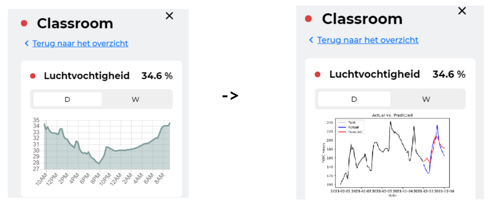
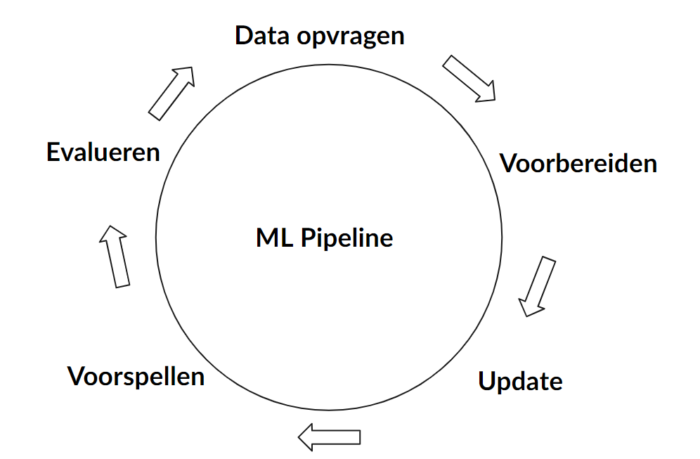
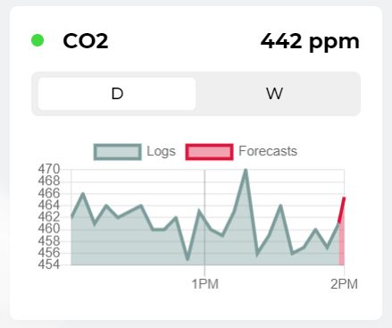
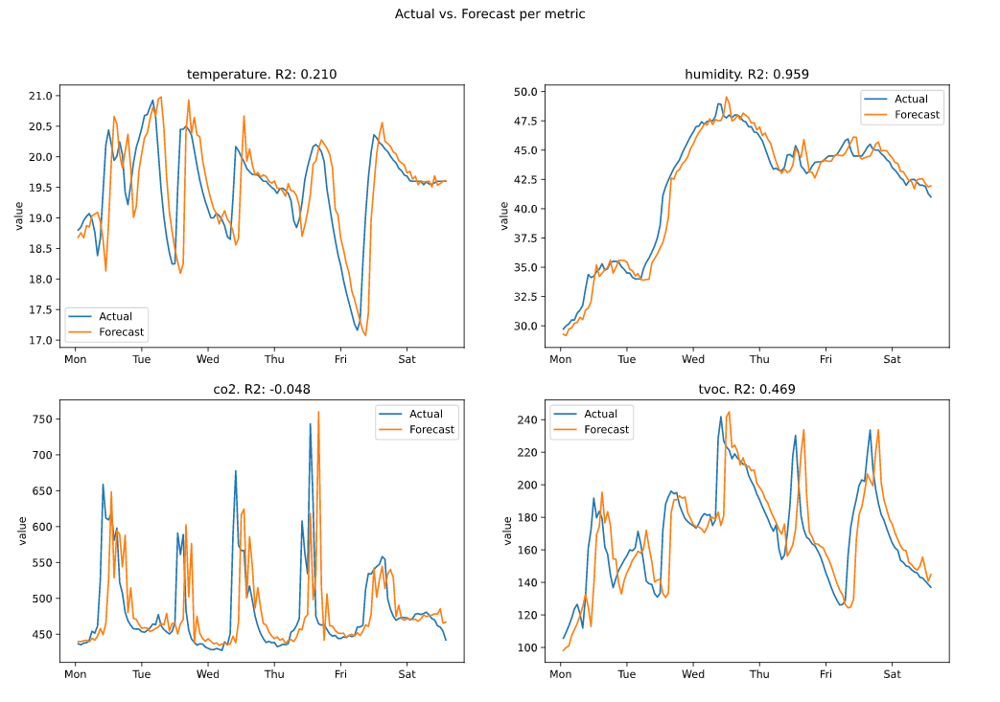
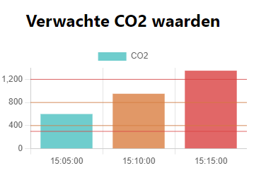

## Manier van aanpak

Tijdens het realiseren van het project is de scrum methode toegepast. Dit betekend dat er gewerkt is in sprint van twee weken. Aan het eind van deze twee weken zijn demo's gegeven aan de mede stagiairs en begeleiders. Daarnaast heeft er iedere vier weken een oplevering voor de belangrijkste stakeholders, Handpicked Labs & Techtenna plaatsgevonden.

In de onderstaande secties zal per oplevering de geplande werkzaamheden, de gerealiseerde werkzaamheden, feedback en reflectie worden toegelicht.

## Oplevering 1: Ontwerp

De eerste oplevering had vooral betrekking op het ontwerp van de applicatie en de machine learning modellen. Meer details over het ontwerp kunnen gevonden worden op de ["Ontwerpen"](ontwerpen.md) pagina.

**Geplande- en afgeronde werkzaamheden**  

| Sprint # | Werkzaamheden             | Afgerond |
| -------- | ------------------------- | -------- |
| 3        | Data requirements analyse | Ja       |
| 3        | Data verzameling          | Ja       |
| 4        | Model experimenten        | Ja       |
| 4        | Ontwerp                   | Ja       |

**Resultaten**  
Tijdens het ontwerpen van de applicatie werd duidelijk dat de modellen redelijk lastig waren om te ontwikkelen. Het oorspronkelijke doel was om voor alle service lagen, luchtkwaliteit, energiebesparing en brandveiligheid, modellen te ontwikkelen. Dit doel bleek niet realistisch te zijn.

Om te voorkomen dat de machine learning modellen falen in de productie omgeving was voorgesteld om het doel te beperken tot luchtkwaliteit. Hierdoor kon er meer focus gelegd worden op het ontwikkelen van een systeem wat periodiek de modellen update en evalueert. Wanneer dit goed werkt kan het uitgebreid worden naar de andere service lagen.

**Feedback**  
Op het eind van de opleveringspresentatie[^1] werd het voorstel gedaan om het doel aan te passen. De reacties hierop waren positief. De stakeholders van Handpicked Labs & Techtenna vonden het allemaal een goed idee om klein te beginnen, een robuust systeem te bouwen en daarna uit te breiden.

**Reflectie**  
Het grootste gedeelte van deze sprints had ik besteed aan de experimenteren. Hierbij was het doel om voor vier verschillende meetwaarden een geschikt model te vinden. Om deze modellen te ontwikkelen waren verschillende technieken onderzocht[^2].

Ik had wat moeite met geschikte modellen intwikkelen, de ARIMA modellen werkte uiteindelijk het beste maar zijn een techniek waar ik nog nooit mee gewerkt heb en zijn lastig om mee te werken. Na wat experimenten uit te voeren vond ik een erg goede bron voor dit type machine learning[^3]. In de toekomst zou het beter zijn als ik eerst dit soort bronnen zoek voordat ik begin met experimenteren.

## Oplevering 2: Integratie ARIMA modellen

Vorige oplevering waren het ontwerp en doelswijzigvoorstel goedgekeurd. Deze oplevering was een eerste versie van dit ontwerp geïmplementeerd.

**Geplande- en afgeronde werkzaamheden**  

| Sprint # | Werkzaamheden          | Afgerond |
| -------- | ---------------------- | -------- |
| 5        | Pipeline implementatie | Ja       |
| 6        | Front-end aanpassingen | Ja       |

**Resultaten**  
In de onderstaande afbeelding is te zien hoe de gewenste uitkomst van de implementatie gepland was. In de linker afbeelding is de start situatie te zien, dit is een visualisatie van de luchtvochtigheid van de afgelopen dag. In de gewenste situatie wordt deze visualisatie uitgebreid met de verwachte luchtvochtigheid voor de komende uren.

<small>Afbeelding 1: Gewenste situatie</small>

Om deze situatie te kunnen realiseren is de pipeline zoals deze in het ontwerp is beschreven ontwikkeld. Onderstaand is in een schematische tekening te zien hoe deze pipeline functioneert.

Periodiek wordt er nieuwe data opgevraagt die voorbereid wordt om de ARIMA modellen te updaten. Hierna worden voorspellingen en evaluaties gemaakt die opgeslagen worden in een database. Deze worden beschikbaar gesteld via een API om, bijvoorbeeld, in het front-end gevisualiseerd te worden.

<small>Afbeelding 2: Pipeline implementatie</small>

Onderstaand is te zien hoe deze voorspellingen verwerkt waren in het front-end. Het eind resultaat lijkt redelijk op de gewenste situatie. Er zijn echter wat onderdelen die niet naar verwachting werkte.

1. De voorspelling is slechts een uur in de toekomst.
2. De ARIMA modellen zijn erg groot (>1GB).
3. De voorspellingen zijn niet accuraat genoeg.

<small>Afbeelding 3: Front-end implementatie</small>

**Feedback**  
Tijdens de presentatie[^4] van de oplevering werd de onderstaande afbeelding getoond. Hierin is te zien dat de voorspellingen altijd ~ 1 uur achter lijken te lopen. Om dit op te lossen is veel tijd besteed aan het controleren met welke data de modellen werden geüpdatet en voor welke tijdstippen de voorspellingen werden gemaakt. Uiteindelijk was, mede door feedback van Marco van Techtenna, de conclusie dat dit een eigenschap is van de modellen die zijn toegepast.

<small>Afbeelding 4: Arima evaluaties</small>

Andere feedback was dat de impact van de visualisatie niet sterk genoeg is om mensen aan te sporen de situatie te veranderen. Aangezien dit de kern van het probleem is opgelost is hiervoor een [tweede iteratie](ontwerpen.md#model-experimenten-versie-2) van de machine learning modellen gedaan.

**Reflectie**  
Tijdens de 5e en 6e sprint was ik vooral bezig met het omzetten van de model experimenten naar een geautomatiseerde pipeline. Hierbij heb ik een API ontwikkelt en het front-end uitgebreid. Via deze API kan het front-end voorspellingen ophalen om te visualiseren.

De voorspellingen die uiteindelijk gevisualiseerd waren maakte niet sde gewenste impact en waren niet accuraat genoeg. Hierdoor moest ik meer model experimenten uitvoeren.

Daarnaast gad ik voor het implementeren van de applicatie maar een sprint ingepland. Uiteindelijk had ik een complete sprint nodig om alleen de pipeline en API te ontwikkelen en een extra halve sprint om het front-end uit te breiden. Hierdoor verwachte ik in tijdsnood zou kunnen komen, dit viel uiteindelijk mee.

## Oplevering 3: Iteratie op integratie

Na aanleiding van de feedback op de tweede iteratie waren nieuwe [model experimenten](ontwerpen.md#model-experimenten-versie-2) uitgevoerd. Deze modellen zijn gebruikt om de pipeline en het front-end aan te passen.

**Geplande werkzaamheden**  

| Sprint # | Werkzaamheden          | Afgerond |
| -------- | ---------------------- | -------- |
| 7        | Model experimenten     | Ja       |
| 8        | Pipeline aanpassingen  | Ja       |
| 8        | Front-end aanpassingen | Ja       |
| 8        | Meldingen weergeven    | Nee      |

**Gerealiseerde werkzaamheden**  
Voordat begonnen was aan het implementeren van de nieuwe modellen in de pipeline en front-end was er een mock-up gemaakt, zie afbeelding 5, van de gewenste eind situatie.

<small>Afbeelding 5: </small>

Door de korte termijn voorspellingen een aparte balkgrafiek te visualiseren en de kleur aan te passen wanneer bepaalde waarden worden overschreden wordt er een gortere impact gemaakt. Op deze manier zal de gebruiker aangespoort worden om in te grijpen wanneer de situatie dreigt te verslechteren.

De aanpassingen die aan de pipeline gemaakt moesten worden waren minimaal. Over het algemeen kon de applicatie versimpeld worden omdat het machine learning model niet afhankelijk is van `timestamps`. 

**Feedback**  

**Reflectie**  

## Algemene evaluaties & reflecties

[^1]: [Oplevering Twindle 3.0 Techtenna #1 07-02-21](pdfs/oplevering_1.pdf)
[^2]: [Ontwerpen: Machine learning experimenten versie 1](ontwerpen.md#model-experimenten-versie-1)
[^3]: [Forecasting: Principles and Practice](https://otexts.com/fpp2/index.html)
[^4]: [Oplevering Twindle 3.0 Techtenna #2 04-05-21](pdfs/oplevering_2.pdf)
